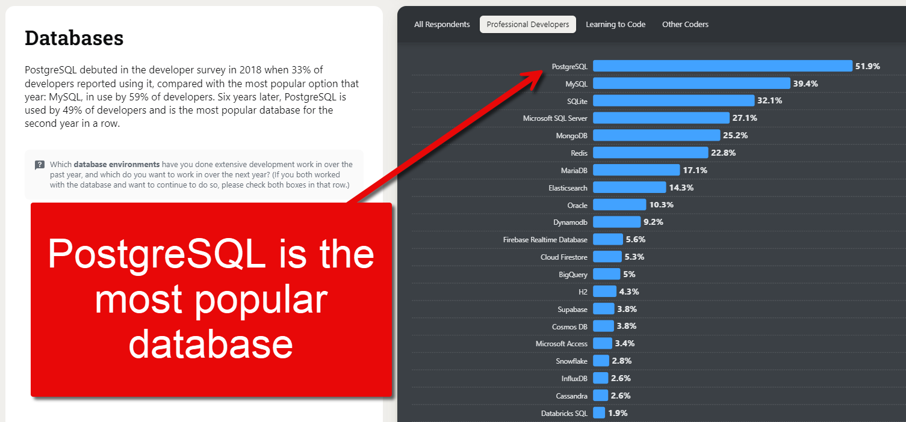
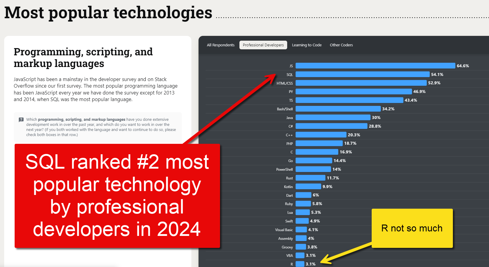

## Learning Objectives

By the end of this chapter, students will be able to:

- **Articulate** at least three reasons why SQL is a foundational skill for data scientists and analysts.
- **Distinguish** between SQL and general-purpose programming languages such as R and Python in terms of purpose and typical use cases.
- **Describe** the role of relational databases in modern data infrastructure.
- **Identify** common job roles and professional workflows where SQL proficiency is required.
- **Compare** relational databases to spreadsheets and flat files, explaining the limitations of each for managing structured data at scale.
- **Explain** why SQL has remained relevant for decades despite the emergence of newer data technologies.

## How to pronounce Sequel

The inevitable question: "Is it pronounced 'Sequel' or 'Ess-Que-Ell?'"

Honest answer: it doesn't matter. Both pronuniciations are fine, and they're both in common usage.

Anecdotally, I do think it's more common for the "ess-que-ell" pronunciation to be used outside the United States. This is only my observation from attending conferences and conversing with fellow data professionals around the world, but it seems that the "sequel" pronunication is more popular to Americans than it is to the rest of the world. But I have zero data to support that.

I've also found it can depend on which variant of SQL you're using. When I was first learning databases, I cut my teeth on Microsoft SQL Server, and Microsoft pretty much universally uses the "sequel" pronunciation. Watch any of their YouTube videos or other content, or go to any of their conferences, and you'll hear "sequel" a billion times. Their employees almost never say "ess-que-ell." And because that's the platform I first learned, that's the pronunciation I normally use.

Other companies with their own products feel differently. MySQL, for example, actually has specifically stated:

> The official way to pronounce “MySQL” is “My Ess Que Ell” (not “my sequel”), but we do not mind if you pronounce it as “my sequel” or in some other localized way.
>
> Source: [MySQL 8.0 Reference Manual](https://dev.mysql.com/doc/refman/8.0/en/what-is-mysql.html){target="_blank"}

Fair enough.

Here's a fun historical fact, though: when SQL was first being written in the 1970s, the developers at IBM gave it the name SEQUEL, which stood for "Structured English Query Language." However, they soon found out that another company had already trademarked "SEQUEL," so IBM shortened it to "SQL."

So you could actually make the argument that it was always _meant_ to be pronounced as "sequel."

But the truth is that it really does not matter. The vast majority of people know that "how to pronounce SQL" is not a hill worth dying on. If you're talking to a data person and they pronounce it "ess-que-ell," you will know exactly what they're talking about. And vice versa if you pronounce it back to them as "sequel."

If somebody berates you because they think you're pronouncing it the "wrong" way, you should tell that person to go touch some grass.
