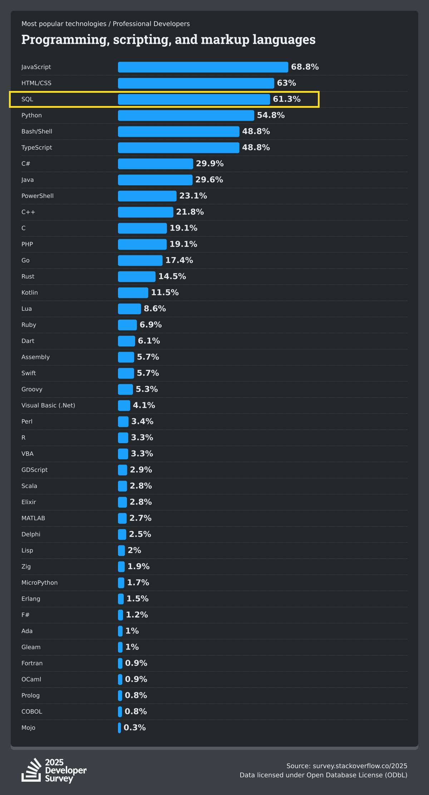
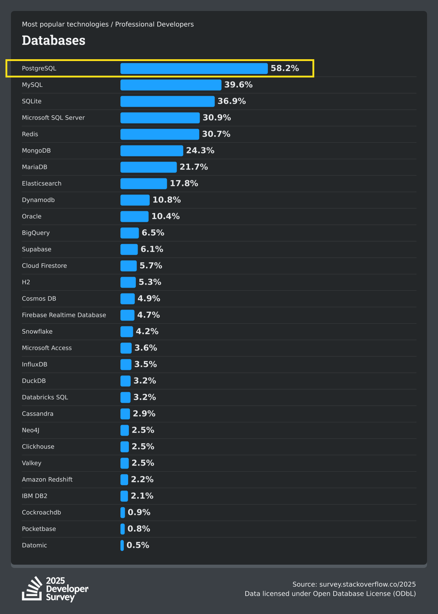

This book is aimed mostly at my data science students at Davidson. It aims to introduce students to SQL who have no prior experience with it, but who need to know the language and the relational model upon which it is built so they can use it for research, app development, etc. Maybe you heard from a friend that a coveted data science internship wants you to know SQL, so you signed up for my Database Programming course to learn these skills. Or maybe you're working on a business where you need to develop a full-stack application, and you need to design the back end of that product.

Whoever you are and whatever brought you here, knowing how to navigate relational databases and retrieve data with SQL are two of the most durable and portable skills a young professional can have now. We live in the Information Age, and the vast majority of that information is stored in databases. Having the necessary technical skills to query and analyze data from those databases sets you up for success in pretty much every industry in existence for decades to come. It's likely you will use databases in your first job after college, and every job after that.

Investment bankers and business analysts do their work on top of relational databases, as do teachers and non-profit administrators. Doctors, lawyers, pharmacists, project managers, retail salespeople... even if they don't realize it, most of these people are probably interacting with relational databases on a daily basis. In spite of their everyday usage, these databases are rarely seen. They run in the background, which is why they are often referred to as the "back end" of a given system or application. They're hidden storage layers with built-in brains, driving your business or your research without most users ever really being aware of it. Ubiquitous, yet invisible.

Yet, someone had to design and construct these databases to store their data. They had to structure the databases in a logical and efficient manner to keep their data consistent and secure. Someone had to build applications that could add data to these databases when, say, a new item gets added to the company's inventory, and someone had to write queries to build a business dashboard that shows how many different types of items are in said inventory. Maybe someone even had to pull the entire history of the company's data into a separate environment so they could run machine learning models against it and try to interpret and predict customer behavior.

There are many aspects to working with databases ranging from the conceptual to the practical, and even the practical side of working with databases is complex and varied. When it comes to the world of data science and analysis, most people's involvement is limited to retrieving data from an existing database they did not build themselves. They showed up to work a job at a company and somebody pointed them to a database or data warehouse and said, "There's your data. Start analyzing." So that's what this book starts with: using SQL to query data for analysis. This is aimed at the foundational database skills most data scientists expect. They want to run statistical models against their organization's data, and that data is kept in a database. The best way to get to it? Use some SQL to either do the analysis in the database, or extract the data using R or Python to perform your analysis with those languages.

However, knowing how to build new databases and how to move data from Point A to Point B are also incredibly valuable, though they are more technical and more specialized. If you're a data scientist who wants to collect massive amounts of data from different sources into a consolidated, well-designed, and high-performance environment, databases are fantastic at this! I basically spent the better part of a decade doing exactly this kind of work. So, once you're familiar with the basics of SQL and how to retrieve data from existing databases, this book moves into the realm of teaching you how to design and construct new databases.

Database design is much more rigorous than SQL, in my opinion, and has robust theoretical underpinnings that you need to understand in order to be effective at it, so this is likely the part you will find most challenging. It requires a strong understanding of the data you're trying to capture and how different entities relate to each other. It requires careful thought, planning, and diagramming. It also requires discussions around data security and how not only to optimize your database for performance, but also how to harden it against data anomalies and bad actors.

After that, we need to tackle the matter of how to even get data into a database in the first place! Now, this is not an application design class, so we're not going to spend much if any time talking about how to make your React app communicate with your database. Instead, we'll talk more about how to move data into a database _in bulk_ through a process known as Extract, Transform, and Load (ETL). This gives you a glimpse into the world of **data engineering**, which is a related discipline to data science, and just happens to be my specialty as a data professional.

Lastly, we'll cover deployment and migration. Deployment is the process by which we take a database we've developed and "publish" it to a location where others can use it. In the old days, this was usually a bare metal server sitting in your company's on-premise data center. Nowadays, it's more likely to be a cloud hosting service that you either manage yourself, or that someone else manages for you. For this part, we'll use a fantastic product called Supabase which will allow us to deploy our databases to the cloud and connect to them from anywhere on the planet, and migrate our databases between different versions.

With all of that in mind, let's take a moment to talk about the history and relevance of both SQL and relational databases. If nothing else, this will reinforce the idea that you've made a good move by choosing to learn these technologies.

As this chapter seeks to illustrate, databases have long been foundational components of our technology landscape. They can be used for storing research data, building commercial platforms, developing video games, almost any scenario imaginable where data needs to persist and be recalled later.

## Wherefore SQL?

SQL (Structured Query Language) is one of the most long-lived and ubiquitous programming languages in our world. It was invented in the 1970s, back when the internet was just a shadowy project of the United States military known as ARPANET, and long before personal computers made their way into people's homes (and pockets).

Many languages have risen in popularity in the decades since, only to crater and fade into obscurity and obsolescence. But SQL remains.

Not only does SQL remain, but it is _everywhere_. In much the same way that HTML is the _lingua franca_ of webpages, SQL is the _lingua franca_ of data.

Why is SQL so enduring? Like all programming languages, it's quirky. It can even be frustrating and inscrutable. What makes it stand the test of time when so many other languages have withered and died?

For one thing, databases have only become more popular and widespread as technology has worked its way into every facet of our lives, and databases have never seen a need to use a language other than SQL. It just does its job so well!

Plus, it's written in an accessible manner, using "plain English" syntax and diction like `SELECT` and `FROM` and `ORDER BY`. And it's a _declarative_ language, meaning you don't have to expend a lot of energy telling the database how to do its job. Instead, you write the SQL to define the "shape" of the data you want to return, and the database engine itself determines the fastest way to get you those results. The declarative nature of SQL (more on this later in the book) and its plain English style make it easy for new users to pick up. This makes it incredibly popular not only with seasoned full-stack software engineers, but also with data analysts and business analysts whose technical skills aren't as deep.

## The emergence of relational databases

Prior to the 1970s, data management largely consisted of rigidly structured hierarchical data stores, often using sequential flat files or physically storage on magnetic tapes and punch cards. Data retrieval was slow and maintenance was a nightmare.

British computer scientist Edgar Codd stepped into this world in 1970 with his seminal paper, _A Relational Model of Data for Large Shared Data Banks_ ([link](https://www.engineering.upenn.edu/~zives/03f/cis550/codd.pdf)), which posited a new paradigm for database organization, the Relational Model. The Relational Model solved many of the problems that predecessor databases suffered from, so it quickly gained traction among researchers and businesses. Codd later won the Turing Award in 1981 for "his fundamental and continuing contributions to the theory and practice of database management systems." [@codd1981turing]

Inspired by Codd's paper, a pair of engineers at IBM, Donald Chamberlin and Ronald Boyce, developed a language that could not only query data from a relational database, but also define its structure, create and manipulate data in its tables, and control access to the database itself. Initially named SEQUEL for "Structured English Query Language," it was published in a 1974 paper [@chamberlinboyce1974sequel] and IBM began developing commercial prototypes based on it.

There's an interesting historical sidenote here, though: another company had already trademarked SEQUEL, so IBM shortened the name of this language to "Structured Query Language," and thus we ended up with SQL.

Unfortunately for IBM, they were painstakingly slow to commercialize SQL and their relational database products, the most prominent of which was called "System R" (not to be confused with the R programming language). IBM had their own predecessor database known as IMS that they wanted to protect from competition, which ended up being one of their most costly mistakes.

Into this void stepped Larry Ellison and his company Relational Software, Inc. (RSI), when they released the Oracle RDBMS (relational database management system) in 1979. They used Codd's research and SQL to develop Oracle, and used it as the basis for financial and manufacturing software that became enormously popular worldwide. So popular, in fact, that Ellison and his partners changed the name of their company from RSI to Oracle. And if you know anything about Silicon Valley history, you know that Oracle became one of the largest companies in the world, catapulting Ellison into insane levels of wealth. As of the time I'm writing this, he's the sixth-richest person in the world.

So, one of Silicon Valley's earliest and biggest success stories was born from SQL and relational databases!

Because they were so early into the market, Oracle and their relational database were dominant for years to come. Many of the largest companies in the world, particularly financial institutions, were early adopters of Oracle databases and continue to favor them to this day. But, as the 1980s went by, more competition emerged in the RDBMS ecosystem: IBM finally caught up and released Db2 in 1983, and Sybase released Sybase SQL Server in 1987. Microsoft then bought the license for Sybase's RDBMS and marketed it as Microsoft SQL Server beginning in 1989. In the years to come, other products emerged, with some great entrants on the open source side like MySQL, PostgreSQL, and SQLite.

There's a lot more history we could cover, and it gets really complicated when you start to factor in the arrival of cloud-native databases in the early 2010s and the growing prominence of data warehouses, which are a form of specialized RDBMS used for analytics and business intelligence (BI). For now, it's sufficient for you to know that relational databases have a long history, and that they are fundamental to how we use data today.

## SQL's role in data science

I firmly believe there are three languages that every data scientist should be comfortable with: R, Python, and SQL. These languages share some similarities, but less in how they are written and more in how they have overlapping or similar functions. Each of these languages can be used to manipulate data. Think of the [dplyr package](https://dplyr.tidyverse.org){target="_blank"} in R, or the [pandas library](https://pandas.pydata.org){target="_blank"} in Python, or its faster and more modern successor [Polars](https://pola.rs){target="_blank"}.

However, each of these excel at different aspects of data science. R is fantastic for statistics, while Python excels at data integration and machine learning. And both of these languages have amazing data visualization extensions you can use, like [ggplot2](https://ggplot2.tidyverse.org){target="_blank"} in R and [Seaborn](https://seaborn.pydata.org){target="_blank"} in Python.

Meanwhile, SQL has almost zero data visualization capabilities, save for the VERY recent launch of a tool called [ggsql](https://ggsql.org){target="_blank"}, which is only in early development as of the time I'm writing this. However, it is far-and-away the best language in the world for manipulating data. It's so effective at this task, in fact, that popular data manipulation libraries in Python and R directly copy SQL's verbiage, using functions like `left_join`, `inner_join`, `union`, `select`, and `groupby`. These are all derived from SQL, which existed decades before these libraries existed.

The trick is that, to use SQL itself, your data needs to be in a database. And that's why a lot of data scientists never learn SQL: when they're in school, they get their data from flat files provided by their instructors. There's nothing inherently wrong with that approach. For one thing, including databases in an introductory data science course really ramps up the technical complexity for students, and that's a figurative minefield that a lot of instructors would prefer to sidestep. But it's not representative of what happens in the real world, in corporate jobs or non-profits where data access is subject to much more rigorous controls.

Indeed, many data science teams will expect you to get your data directly from a SQL database without exporting the data into flat files. There are several reasons for this, but the two I'll highlight are _security_ and _redundancy_. From a security standpoint, your institution's data is probably at its most secure when it's inside the database, behind strict access controls and firewalls. From a redundancy standpoint, copying data out of a database means your company now has more copies of the data it needs to maintain, which requires further storage and access control consideration, as well as the resources needed to keep the copied data fresh as new information enters the source system from which it originated. Speaking from experience, that's not trivial for large companies to do!

To be clear, there are perfectly valid reasons to extract data from databases into flat files. It's not necessarily an anti-pattern to do these things. But some organizations, particularly ones that deal in highly sensitive data that are governed by federal regulations (think healthcare data), enact very stringent policies against the export of data files because it creates huge amounts of risk for them. So, to mitigate potential liability, they may prefer to funnel their data scientists directly into a centralized database or data warehouse.

Another reason to favor giving data scientists direct access to a database or data warehouse is _performance_. Most servers that host these systems have enormous resources at their disposal, meaning memory, compute, and storage. For example, your organization's database server, depending on its predicted workload and the budget it has, may have as much as 128 gigabytes of memory, which is double what a top-of-the-line laptop in today's terms would typically have. Many enterprise database platforms like Microsoft SQL Server now support up to 256 gigabytes and 32 CPU cores! With the right storage array to back up those kinds of specs, like redundant solid-state drives, that means the database can handle hundreds of concurrent connections and perform lightning-fast read/write operations at scales that used to be hard for seasoned database professionals like me to even fathom.

In other words, that database your company is plugging you into can crunch more data, and it can do it faster than your Macbook could ever dream of doing with R and Python.

There are other features of databases, like foreign keys and indexes, that also give databases enormous performance advantages when reading data at scale, and we'll cover those later in this book. But trust me when I say that, when it comes to manipulating massive amounts of data, nothing beats SQL on top of a high-powered database.

Where does SQL fall short? Well, as I mentioned earlier, it's not a data visualization language, but it's also not great for statistics or machine learning, and these are prominent skills in a typical data science education. SQL does have some built-in functions for calculating regression coefficients and the like, but they're limited. In fact, I used to teach those functions in my Database Programming course, but I stopped doing that because it's a course on SQL, and I firmly believe that data scientists should not try to make languages do things they're not optimized for doing. If I want to perform statistical analysis on information that's in a database, I'll write a query to extract only the specific dataset I need into RStudio, and I'll use R to do that analysis. The same rule applies if I want to do some machine learning on that data, or visualization. There are tools out there, like the languages I mentioned above or platforms like Power BI and Tableau, that are much better fits for those specific use cases.

So, the bottom line is to use relational databases for what they're best at: storing and manipulating massive amounts of data.

## SQL's popularity as a programming language

Software developers, data engineers, data scientists, and other tech professionals have strong opinions about different programming languages. This is no secret. Most people have a favorite language, and some languages that they hate.

SQL has long been my favorite programming language, and I'm not the only one. In its annual survey of professional developers, Stack Overflow finds SQL ranked in the top 3 most popular languages worldwide. Here are the [2025 survey results](https://survey.stackoverflow.co/2025/technology#most-popular-technologies-language-language-prof){target="_blank"}:



So, hey! By reading this textbook, you're taking your first steps toward learning (and hopefully eventually mastering) one of the most popular _and_ most ubiquitous programming languages on Earth. Good for you. Hopefully you like it as much as I do.

## PostgreSQL's popularity as a database

There are literally dozens of major SQL database engines on the market today, including open-source and commercial variants. Some of them are optimized for analytical workloads, others for mobile development, others that are designed specifically to be cloud-native.

Even in that crowded field of competitors, PostgreSQL (often shortened to just "Postgres") consistently stands out as the most popular database engine in the world according to Stack Overflow's annual survey of professional developers. The chart below is from the [2025 survey results](https://survey.stackoverflow.co/2025/technology#most-popular-technologies-database-database-prof){target="_blank"}:



I use Postgres in my teaching for this very reason (its popularity), but also because the Postgres team is always making innovative updates to their product, pushing the envelope every year with new enhancements that are driven by the community and the changing landscape of the data profession. it's an **open source** SQL variant, and I'm generally a proponent of open source technologies and principles. If you want to learn more, here's a short read: [the open source way](https://opensource.com/open-source-way){target="_blank"}.

## The many flavors of SQL

You might be wondering: are there differences in the SQL language between all these dozens of database engines? Actually, yes! There are many different SQL "dialects," and not every SQL database supports the same syntax or functions that others do.

For example, the Postgres databases we'll use in this textbook use PL/pgSQL, which means "Procedural Language/PostgreSQL." This language is based on PL/SQL (Procedural Language for SQL), which is the language spoken by Oracle's family of SQL databases. Microsoft databases, meanwhile, use T-SQL, or "Transact SQL," which was the first SQL variant I learned.

What's the impact of this? Well, it's possible you can learn a function in one SQL dialect that does not work in all other dialects. As a matter of fact, two of my favorite SQL functions, `PIVOT` and `UNPIVOT`, don't exist in PostgreSQL at all (much to my chagrin). Instead, PostgreSQL uses its own bespoke `CROSSTAB` function, which has to be installed as an extension.

Some SQL dialects also have their own syntactic shortcuts. Postgres has one that I really like that you can use when converting data from one data type to another. While in most SQL languages this is done with the `CAST()` function, PostgreSQL actually has a shortcut where you can do it with a simple `::` operator. You'll find out more about this in our chapter on Data Types.

Here are some examples of how the exact same query intent gets written differently depending on which type of database you're pointed at. In the first example, we seek to return the top 5 rows from a table named `flights`. In PostgreSQL and MySQL, this is done with the `LIMIT` clause, but in Microsoft SQL Server it's actually done by adding a `TOP` command to the `SELECT` clause:

::: {.panel-tabset}
## PostgreSQL / MySQL

```sql
SELECT * FROM flights LIMIT 5;
```

## Microsoft SQL Server

```sql
SELECT TOP 5 * FROM flights;
```
:::

In the second example, our goal is to take two columns, `first_name` and `last_name`, and combine them into a single column named `full_name` by concatenating their values together with a space in between. Here we have three different approaches: in PostgreSQL and MySQL, you typically use either the `CONCAT()` function, or you use the `||` operator. But in Microsoft SQL Server, you can use the plus sign operator (`+`):

::: {.panel-tabset}
## PostgreSQL / MySQL

```sql
SELECT first_name || ' ' || last_name AS full_name FROM passengers;
SELECT CONCAT(first_name, ' ', last_name) AS full_name FROM passengers;
```

## Microsoft SQL Server

```sql
SELECT first_name + ' ' + last_name AS full_name FROM passengers;
```
:::

Now, before you start freaking out about there being dozens of different SQL dialects and all these various shortcuts, the truth is that all SQL dialects share roughly 90-95% of the exact same core functions, and the skills you pick up in this textbook, whether that's running `SELECT` statements to extract data or building new databases with `CREATE TABLE` statements, are easily transportable to other SQL databases.

SQL was actually standardized in the late 1980s, first by the American National Standards Institute (ANSI), then the following year by the International Standards Organization (ISO) [@iso9075-1-2023]. The ANSI and ISO standards are interchangeable these days, and they have grown and evolved substantially since the 1980s to accommodate new functionality, but it should you to know that almost all SQL dialects in existence largely conform to these standards. Of course, vendors still often experiment and innovate with different ways of writing SQL, but the core of the language is still consistent no matter which platform you're using.

The point is: if you can master one SQL dialect (like the PL/pgSQL we'll be learning in this textbook), you can confidently apply 90+% of what you learn in any other SQL database engine you come across, whether that's Microsoft, Oracle, Snowflake, DuckDB, Google BigQuery, etc.

## How to pronounce SQL

The inevitable question: "Is it pronounced 'Sequel' or 'Ess-Que-Ell?'"

Honest answer: it doesn't matter. Both pronuniciations are fine, and they're both in common usage.

Anecdotally, I do think it's more common for developers outside the United States to use the "ess-que-ell" pronunciation. This is only my observation from attending conferences and conversing with fellow data professionals around the world, but it seems that the "sequel" pronunication is more popular among Americans than it is in the rest of the world. But I have zero data to support that.

I've also found it can depend on which variant of SQL you're using. When I was first learning databases, I cut my teeth on Microsoft SQL Server, and Microsoft pretty much universally uses the "sequel" pronunciation. Watch any of their YouTube videos or other content, or go to any of their conferences, and you'll hear "sequel" a billion times. Their employees almost never say "ess-que-ell." And because that's the platform I first learned, that's the pronunciation I normally use.

Other companies with their own products feel differently. MySQL, for example, actually has specifically stated:

> The official way to pronounce “MySQL” is “My Ess Que Ell” (not “my sequel”), but we do not mind if you pronounce it as “my sequel” or in some other localized way.
>
> Source: [MySQL 8.0 Reference Manual](https://dev.mysql.com/doc/refman/8.0/en/what-is-mysql.html){target="_blank"}

Fair enough. But I also want to refer you back to the historical context I gave you earlier when I mentioned that Chamberlin and Boyce originally wanted to call their language SEQUEL for "Structured English Query Language." The only reason they shortened it to SQL was because some other company had trademarked SEQUEL. So, you could make the argument that it was always _meant_ to be pronounced as "sequel."

At least, that's how I choose to look at it.

At the end of the day, the truth is that it really does not matter. The vast majority of people know that "how to pronounce SQL" is not a hill worth dying on. If you're talking to a data person and they pronounce it "ess-que-ell," you will know exactly what they're talking about. And vice versa if you pronounce it back to them as "sequel."

If somebody berates you because they think you're pronouncing it the "wrong" way, you should tell that person to go touch some grass.
