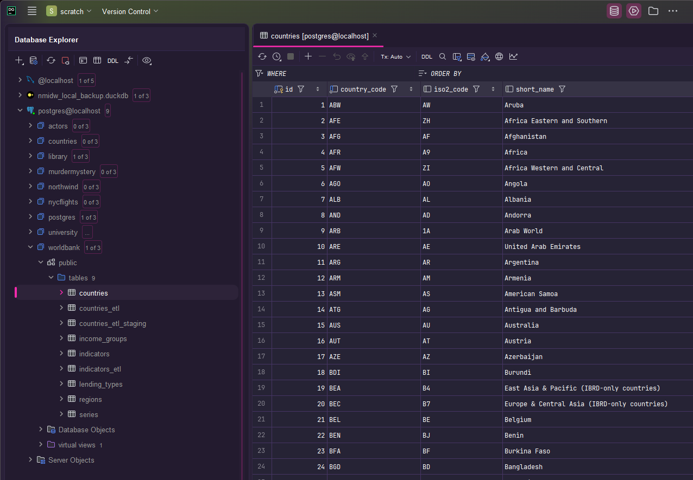
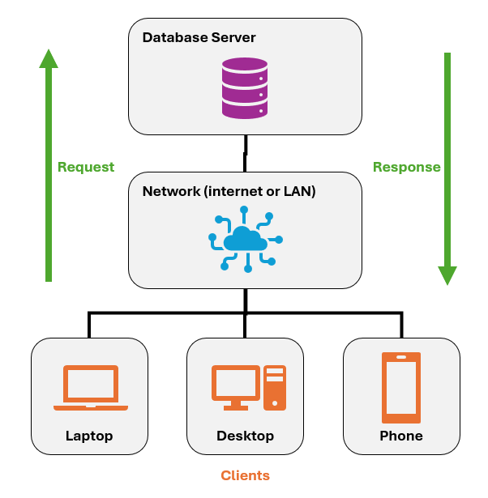
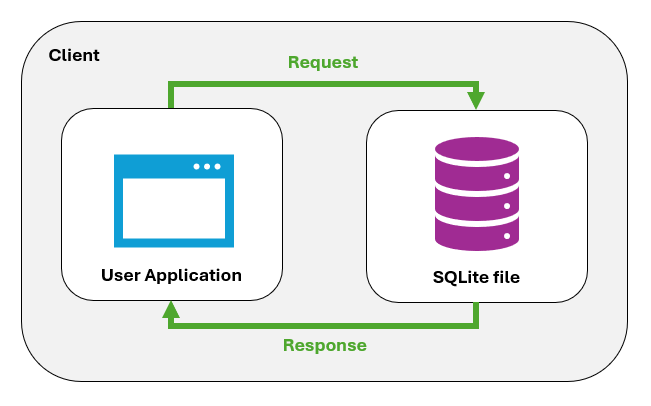
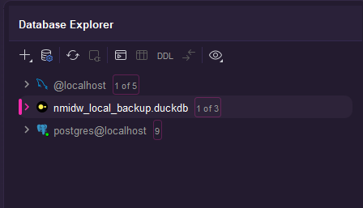
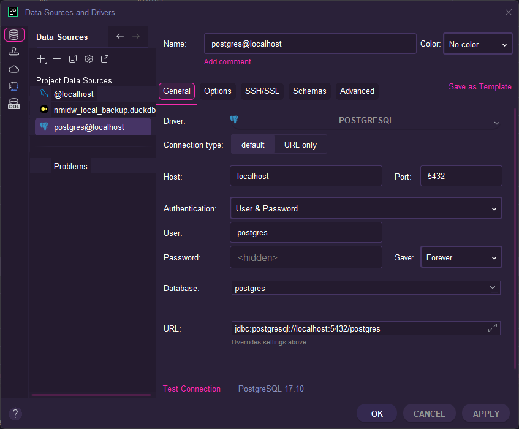

## Intro

As you can probably imagine after reading the previous chapter, there is a dizzying number of pathways we can take towards learning SQL and relational databases. Just the sheer variety of formats and SQL dialects creates a sort of "choose your own adventure" scenario for learners who are new to this world.

I've chosen a specific pathway that I strongly feel is optimized for broad appeal to my learners, real-world relevance, and ease of implementation. That is teaching **PostgreSQL** in a traditional **client-server** setup.

But even with one pathway determined, there are multiple audiences I potentially need to cater to. My primary audience? My Database Programming students at Davidson. This textbook is written for them. However, independent learners may come across this online textbook and decide they want to go on this adventure, too. And they are certainly welcome to do so!

So I've written the book with both audiences in mind, and this chapter provides instructions on how they can each access or create the learning environment that I have curated. For my Davidson students, there is virtually no added work for them to get connected to their learning environment. For independent learners, the barriers are steeper, but there is no cost involved other than the time it takes you to install a few applications.

Before we diverge, though, it helps to introduce some foundational concepts of how databases are deployed, why this informs the particular pathway I chose, and what this means for you as a learner.

## Database architectures

When deciding how to learn SQL and relational databases, one of the first forks in the road is choosing a traditional client-server setup versus an embedded, single-file database. I'm going to assume you're not familiar with the distinction, so I'll explain.

### Client-server databases

The most common way you will interact with databases in the real world is through **client-server** architecture. The database is installed on a server that is managed by your organization, or is provided as a cloud service for a platform like Amazon Web Services (AWS), Microsoft Azure, or Google Cloud Platform (GCP). The server gives substantial resources to the database like memory, compute, and storage, manages concurrent connections and backups, and secures the database against unwanted infiltration and exfiltration.

Meanwhile, you as the user access the database server from a client application (hence "client-server"). For a regular end user, these interactions are most likely to occur within the graphical user interface (GUI) of an app on their phone or computer. Click a button that says "view report?" That might execute a SQL query against the server. Change your password? Probably another SQL query. But the end user never writes the SQL themselves. Instead, the GUI invisibly triggers the database.

For a data analyst, data engineer, or data scientist, database interactions are more likely to occur through an **integrated development environment** (IDE) which gives them the ability to not only write SQL queries, but also explore the structure of the database. Popular examples of some IDEs that are optimized for databases are [DataGrip](https://www.jetbrains.com/datagrip/){target="_blank"}, [DBeaver](https://dbeaver.io){target="_blank"}, [DbVisualizer](https://www.dbvis.com){target="_blank"}, and [SQL Server Management Studio](https://learn.microsoft.com/en-us/ssms/sql-server-management-studio-ssms){target="_blank"}.

{fig-alt="Screenshot of a database IDE showing a list of database tables and a preview of a table containing data about countries"}

In these situations, whether interacting with the database server from an app or an IDE, the client is connecting to the server either over the internet or your organization's local area network (LAN). Either way, the database is remote from your perspective, meaning it's not installed on your laptop or phone. Your client app merely gives you a window into the database.



### Embedded databases

**Embedded databases** are often used when your data needs to be portable, decentralized, and/or bundled with an application. Many of the apps that run on our phones come with embedded databases that store the application data. If you search the files on your phone, you can probably find these database files buried deep in its storage, running silently in the background. WhatsApp is a prominent example of this, where messages, contacts, and other data are encrypted inside local SQLite databases [@Fayyad-Kazan_Kassem-Moussa_Hejase_Hejase_2022].



Notice the difference from the client-server diagram above: everything is contained within the client host, whether that's a phone, laptop, or desktop. There's no separate server to connect to and no network that requests and responses need to traverse. The user application and the database live on the same machine, and that database is just a file. This is what makes embedded databases so portable. No server required!

These diagrams are obviously simplified and high level. There's a lot more nuance in practice. But hopefully these give you a general understanding of the differences between these two modalities.

Another example of embedded database usage I like to highlight? Turn-based video games! "Sid Meier's Civilization" is a personal favorite of mine. The Civ franchise is still going strong after 35+ years, and it had an enormous influence on the formation of the "4X" genre of strategy games (eXplore, eXpand, eXploit, and eXterminate). More recent entries in the Civ series have used an array of SQLite database files behind the scenes to store local game data, and modders are known to change these databases when developing mods.

PLACEHOLDER FOR IMAGE SHOWING DATA FROM CIV V DATABASE

The most popular embedded databases are [SQLite](https://sqlite.org){target="_blank"} and [DuckDB](https://duckdb.org){target="_blank"}. SQLite has been around since the late 1990s, and its portability has made it so ubiquitous that it's even used in the flight software for the Airbus A350 long-range airliner [@sqlite_famous]! Meanwhile, DuckDB is a relatively new embedded database that is optimized for large-scale analytical workloads, becoming increasingly popular with data science teams in particular.

::: callout-note
Later in this book, I'll talk about the difference between _transactional_ databases like SQLite versus analytical ones like DuckDB.
:::

As you might have guessed, the fact that embedded databases like these are portable files that you can literally share via email, cloud sharing services, or GitHub makes them very accessible for users who want to learn SQL without needing to worry about the infrastructure that is needed to support a client-server model, namely a server and an internet connection.

### localhost databases

There's a third scenario I need to mention. It actually is possible to install database server applications on your laptop if you want to. This is known as a "localhost" installation, and the name fits because you are hosting the database locally! You can install PostgreSQL on your laptop and run as many databases on it as you want to; these databases are only limited resources of your laptop, and no internet connection is required to use them.

Essentially, you are treating your laptop as if it is a server, and this is very common practice among software developers who need to develop an application or database locally without needing or wanting to bother with additional infrastructure. I use this approach all the time. In fact, I used a localhost approach to teach my students in the first database class I ever taught, my SQL class for DavidsonX (a platform for massively open online courses).



However, this is still different from an embedded database like SQLite because a localhost database is not portable. You can't attach it to an email and send it to a friend, and it still requires the right software and resources to run a localhost installation. Embedded databases, by contrast, are fully decoupled from any kind of server.

### The bottom line

I deliberated for a long time on which adventure I wanted to choose for teaching this material. My professional history with Microsoft SQL Server biased me towards that platform at first, and it's a very common and reliable product for large organizations, but I chose against it because (A) it's not open source, (B) it's not compatible with Apple devices, and (C) it's more difficult to implement. I eventually chose PostgreSQL for its popularity and its cross-platform compatibility.

At one point I also debated whether to teach using embedded databases in DuckDB. As I said, DuckDB has become hugely popular just in the last few years, especially in the analytics and data science community. This is because it's specifically optimized for large-scale datasets, the kind of stuff you encounter in a data science setting. For that reason, and the aforementioned portability of embedded databases, DuckDB would actually be a relevant and convenient way to teach these things!

However, I eventually decided against DuckDB just based on the grounds that most organizations worldwide use the traditional client-server model, and I want you to have a learning experience that mirrors the real-world as closely as possible. And there are VERY good reasons why you won't typically see SQLite and DuckDB used by whatever company or agency you end up working for in the future. Organizations favor the client-server model because:

1. **Security.** Bad actors or careless employees can't just copy, corrupt, or delete a single file. To destroy a server-hosted database, they need to gain access to both the server AND the database. That isolation of the database deep behind your organization's firewall makes these scenarios very unlikely.

2. **Performance.** As I alluded to in the previous chapter, most database servers have enormous resources at their disposal in terms of compute, memory, and storage. A typical dedicated database server far outstrips the hardware of your phone or laptop. So the client-server model lets organizations put their databases on machines that are best capable of handling lots of concurrent requests, and with no processes other than the database competing for those same resources.

So, when you consider how massive many company databases are, how many people and processes need to use them, and how secure they need to be, it shouldn't surprise you that the client-server model is favored.

Now, if you're developing an app or a game, or you're collecting research data for a small project, I think embedded databases are perfect for that. But at a large-scale enterprise level, you should expect to be working in exactly the kind of setup we're going to use in this book.

## For Davidson students

See the course website for detailed instructions on how to access our PostgreSQL learning environment in JupyterHub. All the databases are pre-installed from my Docker image already and ready for you to begin using.

So you can **stop** reading at this point and ignore the rest of this chapter. Or keep reading if you're curious. Whatever works for you.


## For other learners

Learners from outside Davidson will not have access to our JupyterHub environment. Instead, you can use **Docker** to download and install all of the databases that I use with my Davidson students. This prevents you from needing to do a painstaking localhost installation from scratch. Instead, my Docker image gives you everything you need, pre-installed and pre-configured.

If you're not familiar, Docker lets you run software inside a self-contained environment called a *container*. Think of a container as a lightweight, portable box that holds an application and everything it needs to run, regardless of what operating system or configuration your computer has.

For my database courses, I built a Docker image and published it at `pebenbow/open-sql-docker` ([link](https://hub.docker.com/u/pebenbow){target="_blank"}). Once you pull (download) the image, you can run it on your machine as a container. In this container, you get a PostgreSQL server that is ready for teaching and learning. That means everyone who runs the container is working in an identical environment, which eliminates the "it works on my machine" problem entirely.

### Installing Docker Desktop

Docker Desktop is the application that manages containers on your computer. Follow the instructions for your operating system below.

#### Windows

1. Ensure your system meets the requirements: Windows 10 64-bit (version 21H2 or later) or Windows 11. Docker Desktop on Windows uses the **Windows Subsystem for Linux 2 (WSL 2)** backend.

2. If you have not already enabled WSL 2, open PowerShell as Administrator and run:

   ```powershell
   wsl --install
   ```

   Restart your computer when prompted.

3. Download Docker Desktop for Windows from [https://docs.docker.com/desktop/install/windows-install/](https://docs.docker.com/desktop/install/windows-install/).

4. Run the installer (`Docker Desktop Installer.exe`). Accept the defaults, ensuring **"Use WSL 2 instead of Hyper-V"** is checked.

5. Once installation completes, launch Docker Desktop from the Start menu. The Docker whale icon will appear in your system tray when it is running.

6. Verify the installation by opening a terminal (PowerShell or Command Prompt) and running:

   ```bash
   docker --version
   ```

   You should see output like `Docker version 27.x.x, build ...`.

#### macOS

1. Download Docker Desktop for Mac from [https://docs.docker.com/desktop/install/mac-install/](https://docs.docker.com/desktop/install/mac-install/).

   Choose the correct installer for your hardware:
   - **Apple silicon (M1/M2/M3/M4):** Download the `Apple Silicon` installer.
   - **Intel chip:** Download the `Intel Chip` installer.

   If you are unsure which chip your Mac has, click the Apple menu () → **About This Mac**.

2. Open the downloaded `.dmg` file, drag **Docker** to your Applications folder, and launch it.

3. macOS will prompt you for your password to allow Docker to install its networking components. This is expected.

4. The Docker whale icon will appear in your menu bar when Docker Desktop is running.

5. Verify the installation by opening **Terminal** and running:

   ```bash
   docker --version
   ```

#### Linux

Docker Desktop is available for several Linux distributions. The installation steps vary by distribution, so follow the guide for your system on the Docker documentation site: [https://docs.docker.com/desktop/install/linux/](https://docs.docker.com/desktop/install/linux/).

If you prefer not to install Docker Desktop on Linux, you can install the Docker Engine (CLI only) directly. See [https://docs.docker.com/engine/install/](https://docs.docker.com/engine/install/) and choose your distribution from the list.

After installation, verify Docker is running:

```bash
docker --version
docker run hello-world
```

The second command downloads a small test image and prints a confirmation message. If you see "Hello from Docker!", the installation was successful.

::: {.callout-tip}
On Linux, Docker commands typically require `sudo`. To run Docker without `sudo`, add your user to the `docker` group:

```bash
sudo usermod -aG docker $USER
```

Then log out and back in for the change to take effect.
:::

### Pulling the Course Image

With Docker Desktop installed and running, you can download the course image from Docker Hub. Open a terminal and run:

```bash
docker pull pebenbow/open-sql-docker:latest
```

Docker will download the image in layers and display progress as it goes. This only needs to be done once (or when you want to update to a newer version of the image).

### Running the Container

#### Basic Setup (Recommended)

The following command starts the course container with a **persistent data volume** so that any changes you make to the database are saved even if you stop or restart the container:

```bash
docker run --name open-sql \
  -p 5432:5432 \
  -v open-sql-data:/var/lib/postgresql/data \
  -e POSTGRES_PASSWORD=postgres \
  pebenbow/open-sql-docker:latest
```

Let's break down each flag:

| Flag | Purpose |
|------|---------|
| `--name open-sql` | Gives the container a memorable name so you can start/stop it by name |
| `-p 5432:5432` | Maps port 5432 on your computer to port 5432 inside the container |
| `-v open-sql-data:/var/lib/postgresql/data` | Creates a named volume (`open-sql-data`) for persistent storage |
| `-e POSTGRES_PASSWORD=postgres` | Sets the database password |

The first time you run this command, Docker creates the volume and initializes the database. On subsequent runs, the existing volume (and all your data) will be used automatically.

To run the container in the background (so it doesn't occupy your terminal), add `-d` (detached mode):

```bash
docker run -d --name open-sql \
  -p 5432:5432 \
  -v open-sql-data:/var/lib/postgresql/data \
  -e POSTGRES_PASSWORD=postgres \
  pebenbow/open-sql-docker:latest
```

#### If You Already Have PostgreSQL Installed

If you already have a localhost installation of PostgreSQL running on your machine, it is likely using port 5432, which would conflict with the container. In that case, map the container to a different host port. Port **5433** is a common choice:

```bash
docker run -d --name open-sql \
  -p 5433:5432 \
  -v open-sql-data:/var/lib/postgresql/data \
  -e POSTGRES_PASSWORD=postgres \
  pebenbow/open-sql-docker:latest
```

The format `-p HOST_PORT:CONTAINER_PORT` means "connect port `HOST_PORT` on my machine to port `CONTAINER_PORT` inside the container." The database inside the container still listens on 5432; you just reach it from the outside via 5433.

::: {.callout-note}
Remember this port number. Any time this book shows a connection using port `5432`, substitute `5433` (or whichever port you chose) if you used an alternate port mapping.
:::

### Starting and Stopping the Container

Once you have created the container with `docker run`, you manage it with `docker start` and `docker stop` rather than `docker run`:

```bash
# Start the container
docker start open-sql

# Stop the container
docker stop open-sql

# Check whether the container is running
docker ps
```

You do not need to keep the container running all the time. Start it when you sit down to work through the book, and stop it when you are done.

### Downloading your IDE

Once you've got the Docker container running, you've successfully taken care of the server side of the client-server setup. Now it's time to tackle the **client** side, which means installing an appropriate IDE so you can connect to your Postgres container and begin learning SQL.

There are many database IDEs out there, and I've tried a lot of them. I'll recommend a few options for you, all of them **free**, and all of them **cross-compatible** with Windows, macOS, and Linux operating systems.

1. [DataGrip](https://www.jetbrains.com/datagrip/){target="_blank"} is my favorite database IDE. It's my "daily driver" when I'm doing any kind of database work, whether that's against a server, a localhost installation, or a Docker container. It supports dozens of different database vendors and has a lot of customizations.
2. [DbVisualizer](https://www.dbvis.com){target="_blank"} is a pretty new competitor in the database IDE market, but I've been really impressed with it so far. It has not yet worked its way up to my coveted #1 spot, but it's a worthy contender.
3. [DBeaver](https://dbeaver.io){target="_blank"} benefits from being both venerable _and_ open source. It's a tried-and-true database IDE. It won't win any awards for style versus DataGrip or DbVisualizer, but it's highly reliable.
4. Unlike the previous three options, [pgAdmin](https://www.pgadmin.org){target="_blank"} does not support other types of databases: it is strictly locked to PostgreSQL. That being said, it does Postgres very well, which is why it ships automatically with every installation of Postgres. pgAdmin is like the Honda Civic of database IDEs: it's a steady, no-frills application that can get you from Point A to Point B. And it does so while consuming a lot less memory on your laptop than those other IDEs will consume.
5. [Visual Studio Code](https://code.visualstudio.com){target="_blank"} is not a database-specific IDE, but it is the most popular general-purpose IDE in the world. Don't let the fact that it's a Microsoft product fool you: VS Code slaps. Plus, Microsoft developed a pretty good [PostgreSQL extension](https://marketplace.visualstudio.com/items?itemName=ms-ossdata.vscode-pgsql) for VS Code that gives you all the basic tools you need for writing SQL queries and scripts. This is actually the IDE that I ask my Davidson students to use because VS Code works so beautifully inside of our JupyterHub learning environment. However, it pales in comparison to full-featured IDEs like DataGrip and DbVisualizer, so it would not be my first choice.

::: callout-important
This textbook is IDE-agnostic. That means I really don't care what IDE you use because your experience should be relatively equal regardless of which one you employ. This chapter is the last time in this book that you'll see a screenshot or any mention of a specific IDE.
:::

Once you've downloaded and installed your IDE of choice, then you should follow its instructions to set up your first connection to the PostgreSQL container.

### Connecting to the Database

Your connection credentials for the course container are:

| Setting | Value                           |
|---------|---------------------------------|
| Host | `localhost` |
| Port | `5432` (or `5433` if you used the alternate port) |
| Database | Depends on the lesson, but start with `postgres` whenever creating new databases |
| Username | `postgres` |
| Password | `postgres` |

In a database IDE like DataGrip, the connect dialog will look something like the screenshot below, and you can see the different options I just described.

::: callout-note
Your IDE will probably require you to download specific drivers depending on what kind of database you are trying to connect to. DataGrip actually makes this very easy by alerting you whenever you don't have the necessary driver(s) installed, and giving you a simple one-click download button to retrieve those drivers. I really cannot recommend DataGrip enough. It's the best.
:::


