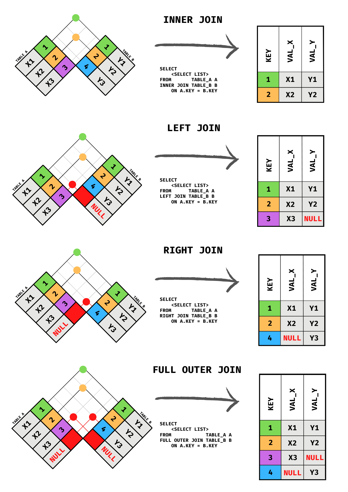
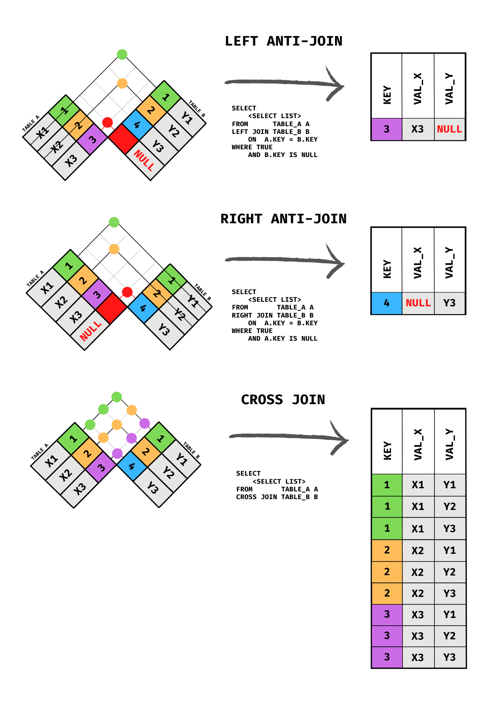

# Joining Tables

::: {.callout-note}
The code examples in this chapter use the `worldbank` database. The SQL shown in each block is illustrative and the exact column names will be confirmed once the database schema is finalized. All examples will be converted to executable code blocks at that time.
:::

Every query you have written so far has drawn from a single table. That is useful, but it is not the whole story. Real databases almost always store related information across multiple tables, and one of SQL's most powerful capabilities is the ability to combine those tables into a single result. That operation is called a **join**.

This chapter explains why data is structured across multiple tables in the first place, introduces the key concepts of primary keys, foreign keys, and cardinality, and then walks through every major join type with diagrams and examples. By the end, you will be able to assemble information from several related tables into exactly the view you need.

## Keys and Relationships

To understand joins, you first need to understand how tables are related to each other. Relational databases are built around the idea that data should be stored once and referenced many times, rather than repeated in every table that needs it. The mechanism that makes this possible is the relationship between tables, expressed through keys.

### Primary Keys

A **primary key** is a column, or combination of columns, whose values uniquely identify each row in a table. No two rows in a table can share the same primary key value, and the primary key column cannot be NULL.

Primary keys come in two common forms:

- **Natural keys** use a value that already exists in the data and is inherently unique, such as a country's three-letter ISO code or a flight number.
- **Surrogate keys** are artificial values added solely to serve as identifiers, typically auto-incrementing integers (`1`, `2`, `3`, ...) with no meaning outside the database.

Natural keys are intuitive but can cause problems if the "unique" real-world value turns out to change or repeat. Surrogate keys are more stable, which is why they appear so frequently in production databases.

When no single column is sufficient to uniquely identify every row, two or more columns together can serve as the primary key. This is called a **composite primary key**. The `observations` table in this chapter is a good example: no individual column (country code, indicator code, or year) is unique on its own, but the combination of all three identifies exactly one measurement. Composite primary keys appear frequently in junction tables and in any table that records events or measurements tied to multiple entities at once.

### Foreign Keys

A **foreign key** is a column in one table that holds values matching the primary key of another table. It is the bridge between two tables and the foundation of every join.

For example, if a `countries` table has a column called `region_code`, and a `regions` table has `region_code` as its primary key, then `countries.region_code` is a foreign key pointing to `regions`. Every value in `countries.region_code` should correspond to a row that actually exists in `regions`. This guarantee is called **referential integrity**, and the database can enforce it automatically once the foreign key relationship is declared.

The table that holds the foreign key is called the **child** table. The table being referenced is the **parent** table. In the example above, `countries` is the child and `regions` is the parent.

### Cardinality

**Cardinality** describes how many rows in one table can relate to how many rows in another. There are three fundamental patterns.

**One-to-one.** Each row in Table A corresponds to at most one row in Table B, and vice versa. This pattern is relatively rare. It sometimes appears when a large table is split in two for organizational or access-control reasons.

**One-to-many.** Each row in Table A can relate to many rows in Table B, but each row in Table B relates to exactly one row in Table A. This is the most common cardinality in relational databases. A region has many countries; each country belongs to one region. An indicator has many recorded observations; each observation belongs to one indicator.

**Many-to-many.** Each row in Table A can relate to many rows in Table B, and each row in Table B can relate to many rows in Table A. A country can have many indicators measured over many years, and the same indicator can be measured for many countries. This relationship cannot be expressed with just two tables. It requires a third table, often called a **junction table** or **bridge table**, whose rows each pair one row from Table A with one row from Table B.

Understanding cardinality before writing a join is important because it tells you how many result rows to expect. Joining a parent table to a child in a one-to-many relationship will produce more rows than the parent table alone, one result row for each matching child. Forgetting this is a common source of unintentionally duplicated rows.

## The worldbank Database

The examples in this chapter use the `worldbank` database, which organizes World Bank development data across five related tables. This picks up thematically from the `countries` dataset used in earlier chapters while introducing the multi-table structure needed to explore joins.

The five tables and their relationships are:

| Table | Primary Key | Description |
|---|---|---|
| `regions` | `region_code` | One row per world region |
| `income_groups` | `income_code` | One row per World Bank income classification |
| `countries` | `country_code` | One row per country or territory |
| `indicators` | `indicator_code` | One row per World Bank development indicator |
| `observations` | `(country_code, indicator_code, year)` | One row per country-indicator-year measurement |

The foreign key relationships are:

- `countries.region_code` references `regions.region_code` (many countries to one region)
- `countries.income_code` references `income_groups.income_code` (many countries to one income group)
- `observations.country_code` references `countries.country_code`
- `observations.indicator_code` references `indicators.indicator_code`

The `observations` table is the junction table that resolves the many-to-many relationship between `countries` and `indicators`.

## JOIN Syntax

Before looking at specific join types, it helps to see the general shape of a join query.

```sql
SELECT
    a.column_one,
    b.column_two
FROM table_a AS a
JOIN table_b AS b ON a.key_column = b.key_column;
```

A few things to note.

**Table aliases.** The `AS a` and `AS b` after each table name assign short aliases. These are optional but almost universally used when joining tables, because they make it possible to refer to columns unambiguously without typing the full table name each time.

**Column qualification.** When two tables share a column name, you must prefix the column name with the table alias to tell the database which one you mean. Writing `a.key_column` instead of just `key_column` prevents ambiguity. Even when column names do not overlap, qualifying them explicitly is good practice in join queries because it makes it immediately clear where each column originates.

**The ON clause.** This is where you specify the condition that links the two tables. Almost always this is an equality between a foreign key in one table and the primary key in another, though more complex conditions are possible.

::: {.callout-tip}
PostgreSQL also supports a `USING` clause as a shorthand when both tables share an identically named join column:

```sql
FROM countries
JOIN regions USING (region_code)
```

`USING` is concise, but `ON` is more explicit and works in every situation, so this book uses `ON` throughout.
:::

## Reading the Diagrams

The diagrams in this chapter use the **checkered flag** method to illustrate joins. Each diagram shows two tables arranged as rotated grids facing each other. Color-coded cells identify which rows from each table contribute to the result, and a result table on the right shows the output.

This approach is deliberately different from the Venn diagrams you may have seen elsewhere. Venn diagrams are not entirely wrong — Codd's relational model defines a relation as an unordered set of tuples, so the set-based intuition has a legitimate foundation. The problem is more subtle. A Venn diagram implies that the "intersection" consists of rows that are identical members of both tables, the way the number 3 might belong to both Set A and Set B. A SQL join does not work that way. The two tables being joined typically contain different things entirely — countries in one, regions in another — and the join matches rows across them based on a condition you specify, usually a foreign key relationship. There is no literal overlap of identical elements. Venn diagrams also fail to convey cardinality: when one region joins to many countries, the result has one row per country, but the overlapping-circles picture gives no indication of that. The checkered flag diagrams make the row-matching process explicit, showing which rows from each table appear in the result and how NULLs fill in for unmatched rows in outer joins.

{fig-alt="Four checkered flag join diagrams showing the rows returned by INNER JOIN, LEFT JOIN, RIGHT JOIN, and FULL OUTER JOIN" width="80%"}

## INNER JOIN

An `INNER JOIN` returns only the rows where the join condition is satisfied in **both** tables. Rows that have no match on the other side are excluded from the result entirely.

This is the default join type. Writing `JOIN` without a qualifier is equivalent to writing `INNER JOIN`.

```sql
SELECT
    c.country_name,
    c.country_code,
    r.region_name
FROM countries AS c
INNER JOIN regions AS r ON c.region_code = r.region_code;
```

This query pairs each country with its region name. Because the join is inner, any country whose `region_code` does not match a row in `regions` would be excluded. Conversely, any region with no countries would also not appear. Only the matched pairs make it into the result.

A second example joins `countries` to `income_groups`:

```sql
SELECT
    c.country_name,
    ig.income_name,
    r.region_name
FROM countries AS c
INNER JOIN income_groups AS ig ON c.income_code = ig.income_code
INNER JOIN regions AS r ON c.region_code = r.region_code;
```

This chains two inner joins together. Each join adds another table to the result. The order in which you list them does not change the logical output, though it can affect readability.

::: {.callout-note}
When a column name exists in only one of the joined tables, you can reference it without a qualifier and PostgreSQL will resolve it unambiguously. However, any column name that appears in more than one table must be qualified with the table alias, or the query will fail with an "ambiguous column" error. When in doubt, qualify every column.
:::

## LEFT JOIN

A `LEFT JOIN` (also written `LEFT OUTER JOIN`) returns **all rows from the left table** and the matching rows from the right table. Where no match exists in the right table, the right-side columns are filled with NULL.

The "left" table is the one named in the `FROM` clause. The "right" table is the one named in the `JOIN` clause.

```sql
SELECT
    c.country_name,
    o.year,
    o.value
FROM countries AS c
LEFT JOIN observations AS o ON c.country_code = o.country_code;
```

This returns every country, whether or not it has any observations recorded. Countries with no observations will appear with NULL in the `year` and `value` columns. Countries with multiple observations will appear once per observation.

Left joins are extremely common in analytical queries because they let you start with a complete reference list (all countries) and attach available data without discarding entries that happen to have gaps.

### Filtering on the Right Table

There is an important subtlety when you combine a `LEFT JOIN` with a `WHERE` clause that filters on the right-side table. Consider this query:

```sql
-- This accidentally turns a LEFT JOIN into an INNER JOIN
SELECT
    c.country_name,
    o.year,
    o.value
FROM countries AS c
LEFT JOIN observations AS o ON c.country_code = o.country_code
WHERE o.year = 2020;
```

The intent might be to get all countries, with observations from 2020 where available. But the `WHERE o.year = 2020` condition filters out every row where `o.year` is NULL, which are exactly the countries with no observations. The left join's promise of "all left rows" is silently undone.

The correct approach is to move that condition into the `ON` clause, where it becomes part of the join itself rather than a post-join filter:

```sql
SELECT
    c.country_name,
    o.year,
    o.value
FROM countries AS c
LEFT JOIN observations AS o
    ON c.country_code = o.country_code
    AND o.year = 2020;
```

Now every country appears in the result. Countries with a 2020 observation show the value; countries without one show NULL.

### RIGHT JOIN

A `RIGHT JOIN` is the mirror image of a `LEFT JOIN`. It returns all rows from the right table and the matching rows from the left, filling unmatched left-side columns with NULL.

```sql
SELECT
    c.country_name,
    r.region_name
FROM countries AS c
RIGHT JOIN regions AS r ON c.region_code = r.region_code;
```

This would return every region, even one that has no countries assigned to it, with NULL in the country columns for any unmatched region.

In practice, `RIGHT JOIN` is used infrequently. Any right join can be rewritten as a left join by swapping the order of the tables, which most developers find more readable. The queries below produce identical results:

```sql
-- RIGHT JOIN
FROM countries AS c
RIGHT JOIN regions AS r ON c.region_code = r.region_code

-- Equivalent LEFT JOIN (tables reversed)
FROM regions AS r
LEFT JOIN countries AS c ON c.region_code = r.region_code
```

## FULL OUTER JOIN

A `FULL OUTER JOIN` returns **all rows from both tables**. Rows that have a match are joined together. Rows from the left table with no right-side match appear with NULLs on the right. Rows from the right table with no left-side match appear with NULLs on the left.

```sql
SELECT
    c.country_name,
    r.region_name
FROM countries AS c
FULL OUTER JOIN regions AS r ON c.region_code = r.region_code;
```

The result includes every country (with their region where one exists) and every region (with NULLs for `country_name` where no country belongs to it).

Full outer joins are less common than inner or left joins but are useful when you need a complete picture of two tables and want to identify rows on either side that have no corresponding partner. Comparing two versions of the same dataset to find insertions, deletions, and changes is a classic use case.

## CROSS JOIN

A `CROSS JOIN` produces the **Cartesian product** of two tables: every row from the left table is paired with every row from the right table. If the left table has M rows and the right table has N rows, the result has M × N rows. No join condition is specified.

{fig-alt="Three checkered flag diagrams showing LEFT ANTI-JOIN, RIGHT ANTI-JOIN, and CROSS JOIN" width="80%"}

```sql
SELECT
    c.country_name,
    i.indicator_name
FROM countries AS c
CROSS JOIN indicators AS i;
```

If there are 200 countries and 300 indicators, this query returns 60,000 rows. Cross joins grow very quickly.

Accidental cross joins are one of the most common sources of runaway queries in SQL. They happen when a join condition is missing or typo'd, causing the database to pair every row with every other row. Always double-check that a `JOIN` clause has an `ON` condition unless you genuinely intend a cross join.

Intentional cross joins do have legitimate uses. Generating all possible combinations of two dimensions (such as all date-region pairings to create a complete reporting grid with no gaps) is a situation where a cross join is the right tool.

## Anti-Joins

An **anti-join** returns rows from one table that have **no matching row** in the other table. It is the complement of an inner join.

Anti-joins do not have a dedicated keyword in SQL. They are expressed using one of two patterns.

### Using LEFT JOIN and IS NULL

The most common pattern extends a left join with a `WHERE` clause that keeps only the rows where the right side produced a NULL, meaning no match was found.

```sql
SELECT
    c.country_name,
    c.country_code
FROM countries AS c
LEFT JOIN observations AS o ON c.country_code = o.country_code
WHERE o.country_code IS NULL;
```

This returns every country that has no observations in the `observations` table. The left join brings in all countries; the `WHERE` clause discards the ones that did match, leaving only those that did not.

::: {.callout-tip}
Filter on a column that would be the join key from the right table, not a data column. The join key is guaranteed to be NULL only when no match was found. A data column could be NULL for other reasons, which would produce false positives.
:::

### Using NOT EXISTS

The second pattern uses `NOT EXISTS` with a correlated subquery. This is the approach mentioned in the WHERE clause chapter as the preferred alternative to `NOT IN` when NULL values may be present.

```sql
SELECT
    c.country_name,
    c.country_code
FROM countries AS c
WHERE NOT EXISTS (
    SELECT 1
    FROM observations AS o
    WHERE o.country_code = c.country_code
);
```

The subquery runs once for each row in `countries`, checking whether any matching row exists in `observations`. If none is found, `NOT EXISTS` returns TRUE and the country is included in the result.

Both patterns produce the same rows. The `LEFT JOIN / IS NULL` form is often more familiar to beginners. The `NOT EXISTS` form can be faster on large tables and handles NULL values in the join key more predictably, which is why many experienced SQL writers prefer it.

## Joining More Than Two Tables

Nothing limits a query to two tables. You can chain as many joins as the data requires, adding one table at a time.

```sql
SELECT
    c.country_name,
    r.region_name,
    ig.income_name,
    i.indicator_name,
    o.year,
    o.value
FROM observations AS o
INNER JOIN countries AS c  ON o.country_code    = c.country_code
INNER JOIN regions AS r    ON c.region_code     = r.region_code
INNER JOIN income_groups AS ig ON c.income_code = ig.income_code
INNER JOIN indicators AS i ON o.indicator_code  = i.indicator_code;
```

This single query assembles all five tables into a flat result: each observation row is enriched with the country name, region, income group, and indicator name. Starting from `observations` (the junction table) and joining outward to each parent is a common pattern when the junction table is the natural "fact" table of the query.

A few practical notes on multi-table joins:

**Start from the table that drives the query.** If you want one row per observation, start from `observations`. If you want one row per country, start from `countries`. The starting table sets the row grain of the result.

**Each join adds columns, not necessarily rows.** A join to a parent table in a many-to-one relationship (observations to countries) does not change the number of rows. A join to a child table in a one-to-many relationship (countries to observations) multiplies rows. Understanding this keeps the result size predictable.

**Order joins for readability.** SQL does not require joins in any particular sequence, but organizing them so that each new table connects to something already in the query makes the logic easier to follow.

## Exercises

### Reflection

1. Explain the difference between a primary key and a foreign key. Why does a database need both?

2. A data analyst runs an inner join between a `countries` table (215 rows) and an `observations` table and gets back over 50,000 rows. They suspect something went wrong. Is this necessarily a problem? Explain what could cause the result to have many more rows than either input table.

3. What is the difference between putting a filter condition in the `ON` clause of a left join versus putting it in the `WHERE` clause? When does the placement matter?

4. Describe two different SQL patterns that produce an anti-join. In what circumstances might you prefer one over the other?

### Coding

::: {.callout-note}
The exercises below require the `worldbank` database. Code block solutions will be provided once the database is available.
:::

5. Write a query that returns the name and region of every country in the `countries` table. Use an inner join to bring in the region name from the `regions` table. Sort alphabetically by country name.

6. Write a query that returns every country along with its income group classification. Countries that have no income group recorded should still appear in the result, with NULL in the income group column. Sort by income group name, then by country name.

7. Write a query that returns the country name, indicator name, year, and value for all observations where the year is 2020. Include only rows where all four values are present.

8. Write a query that returns the names of all countries that have **no observations** recorded in the `observations` table. Use the `LEFT JOIN / IS NULL` pattern.

9. Rewrite the query from exercise 8 using `NOT EXISTS` instead of `LEFT JOIN / IS NULL`. Confirm that both queries return the same set of countries.
