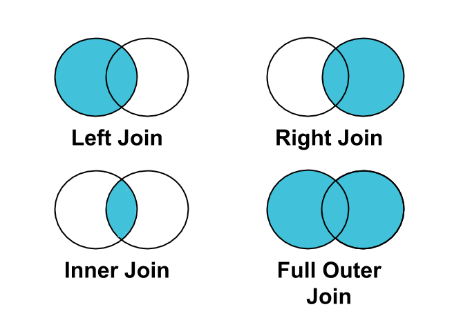
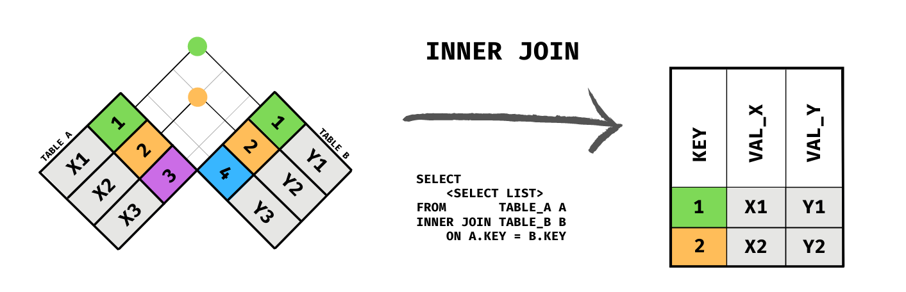
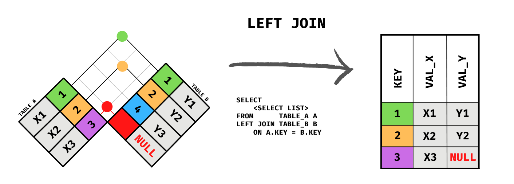
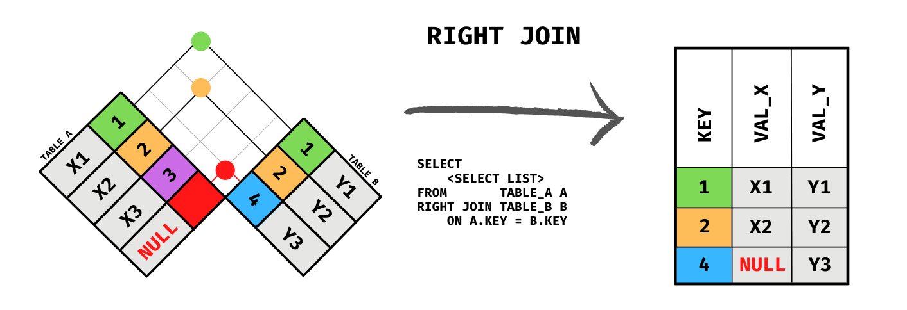
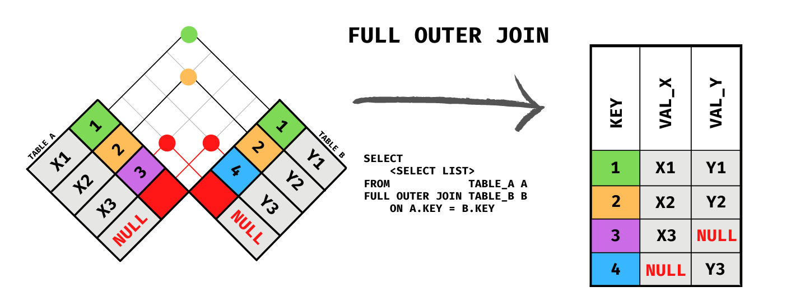
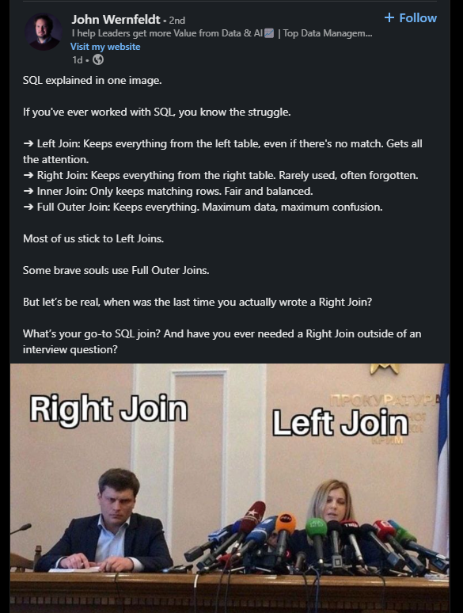
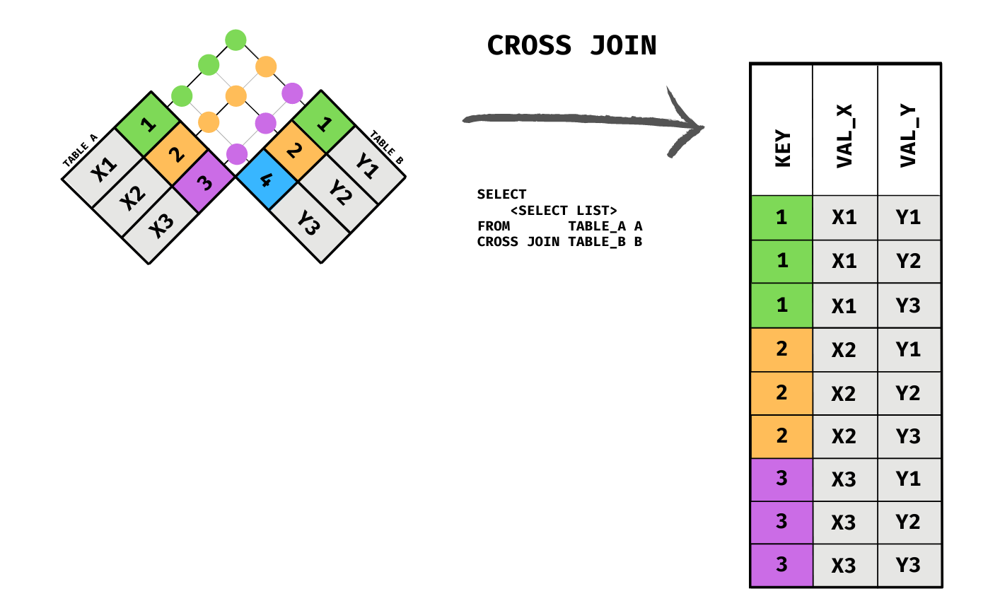
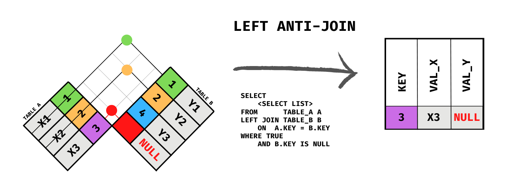
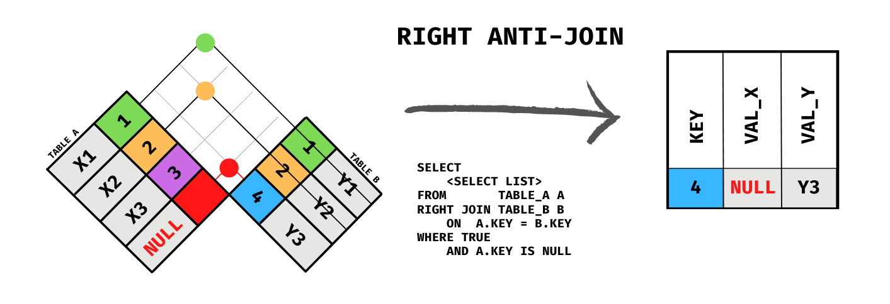
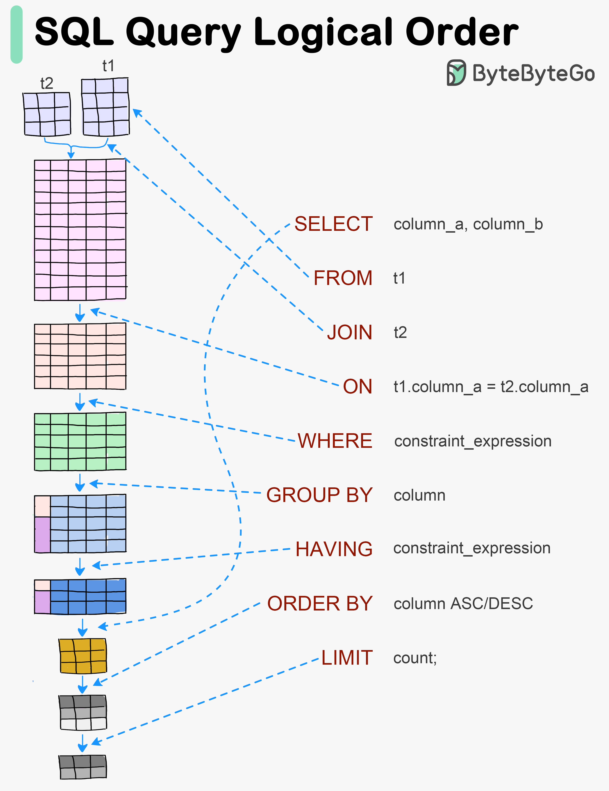

## Learning Objectives

By the end of this chapter, students will be able to:

- **Explain** what a join is and why it is necessary when data is spread across multiple related tables.
- **Write** an `INNER JOIN` to combine rows from two tables based on a matching key column.
- **Apply** a `LEFT JOIN` to preserve all rows from the left table, including those with no match on the right.
- **Distinguish** between `INNER JOIN`, `LEFT JOIN`, `RIGHT JOIN`, and `FULL OUTER JOIN` and predict the row count each produces for a given pair of tables.
- **Use** table aliases to write more concise and readable join queries.
- **Write** a query that joins three or more tables in a single statement.
- **Apply** a self-join to compare or relate rows within the same table.
- **Use** `CROSS JOIN` to produce a Cartesian product and identify a practical scenario where this is the intended behavior.
- **Diagnose** unexpected duplicate rows caused by one-to-many join relationships and correct the query.
- **Select** the appropriate join type for a given analytical question.
- **Locate** `JOIN` and `ON` within SQL's logical order of execution and explain why that order governs the behavior of `ON` vs. `WHERE` with outer joins.

```{r}
#| include: false
library(DBI)
library(RPostgres)

options(knitr.kable.NA = "NULL")
knitr::opts_chunk$set(max.print = 100)
knitr::opts_knit$set(sql.print = function(x) as.character(knitr::knit_print(rmarkdown::paged_table(x))))

con <- dbConnect(
  Postgres(),
  host     = "localhost",
  port     = as.integer(Sys.getenv("PGPORT", unset = "5432")),
  dbname   = "worldbank",
  user     = "postgres",
  password = Sys.getenv("PGPASS", unset = "postgres")
)
```

Every query you have written so far has drawn from a single table. That is useful, but it is not the whole story. Real databases almost always store related information across multiple tables, and one of SQL's most powerful capabilities is the ability to combine those tables into a single result. That operation is called a **join**.

This chapter explains why data is structured across multiple tables in the first place, introduces the key concepts of primary keys, foreign keys, and cardinality, and then walks through every major join type with diagrams and examples. By the end, you will be able to assemble information from several related tables into exactly the view you need.

## Keys and Relationships

To understand joins, you first need to understand how tables are related to each other. Relational databases are built around the idea that data should be stored once and referenced many times, rather than repeated in every table that needs it. The mechanism that makes this possible is the relationship between tables, expressed through keys.

### Primary Keys

A **primary key** is a column, or combination of columns, whose values uniquely identify each row in a table. No two rows in a table can share the same primary key value, and the primary key column cannot be NULL.

Primary keys come in two common forms:

- **Natural keys** use a value that already exists in the data and is inherently unique, such as a country's three-letter ISO code or a flight number.
- **Surrogate keys** are artificial values added solely to serve as identifiers, typically auto-incrementing integers (`1`, `2`, `3`, ...) with no meaning outside the database.

Natural keys are intuitive but can cause problems if the "unique" real-world value turns out to change or repeat. Surrogate keys are more stable, which is why they appear so frequently in production databases.

When no single column is sufficient to uniquely identify every row, two or more columns together can serve as the primary key. This is called a **composite primary key**. The `indicators` table in this chapter is a good example: neither `country_id` nor `year` is unique on its own, but the combination of the two identifies exactly one row, the measurements recorded for that country in that year.

### Foreign Keys

A **foreign key** is a column in one table that holds values matching the primary key of another table. It is the bridge between two tables and the foundation of every join.

For example, the `indicators` table has a column called `country_id`, and the `countries` table has `id` as its primary key. The column `indicators.country_id` is a foreign key pointing to `countries.id`. Every value in `indicators.country_id` should correspond to a row that actually exists in `countries`. This guarantee is called **referential integrity**, and the database can enforce it automatically once the foreign key relationship is declared.

The table that holds the foreign key is called the **child** table. The table being referenced is the **parent** table. In this example, `indicators` is the child and `countries` is the parent.

### Cardinality

**Cardinality** describes how many rows in one table can relate to how many rows in another. There are three fundamental patterns.

**One-to-one.** Each row in Table A corresponds to at most one row in Table B, and vice versa. This pattern is relatively rare. It sometimes appears when a large table is split in two for organizational or access-control reasons.

**One-to-many.** Each row in Table A can relate to many rows in Table B, but each row in Table B relates to exactly one row in Table A. This is the most common cardinality in relational databases. One country can have many rows in `indicators`, one for each year that data was recorded. Each indicator row, in turn, belongs to exactly one country.

**Many-to-many.** Each row in Table A can relate to many rows in Table B, and each row in Table B can relate to many rows in Table A. A student can be enrolled in many courses, and the same course can have many students. This relationship cannot be expressed with just two tables. It requires a third table, often called a **junction table** or **bridge table**, whose rows each pair one row from Table A with one row from Table B.

Understanding cardinality before writing a join is important because it tells you how many result rows to expect. Joining a parent table to a child in a one-to-many relationship will produce more rows than the parent table alone, one result row for each matching child. Forgetting this is a common source of unintentionally duplicated rows.

This chapter introduces primary keys, foreign keys, and cardinality as the practical foundation for writing joins. The database design section later in this book covers all three in greater depth, including how to declare and enforce them in SQL using `CREATE TABLE` statements and column constraints, and how normalization principles guide decisions about table structure.

## The worldbank Database

The examples in this chapter use the `worldbank` database. Three tables are used from the start:

| Table | Primary Key | Description |
|---|---|---|
| `countries` | `id` | One row per country or territory (299 rows) |
| `indicators` | `(country_id, year)` | One row per country-year with multiple measurement columns (16,704 rows) |
| `series` | `id` | Metadata describing each measurement type (9 rows) |

Two more lookup tables come into play once this chapter reaches joining more than two tables at a time:

| Table | Primary Key | Description |
|---|---|---|
| `regions` | `region_id` | Human-readable name for each of the 7 world regions `countries.region_id` points to |
| `income_groups` | `income_group_id` | Human-readable name for each of the 5 income classifications `countries.income_group_id` points to |

The enforced foreign key relationships are:

- `indicators.country_id` references `countries.id`
- `countries.region_id` references `regions.region_id`
- `countries.income_group_id` references `income_groups.income_group_id`
- `countries.lending_type_id` references a similar `lending_types` lookup table, not used in this chapter's examples

The `countries` table includes both individual countries and regional aggregates such as "Africa" and "High income", flagged by the boolean column `is_aggregate`. Aggregate entries have NULL `region_id` and `income_group_id`, since they do not belong to a real region or income classification. 38 rows in `countries` (37 aggregates, plus one country not yet sovereign for the years this data covers) have no corresponding rows in `indicators`, which records data only for individual countries with recorded measurements. That natural gap is what makes the left join and anti-join examples in this chapter meaningful.

The `indicators` table stores measurements as columns rather than rows. Each row captures one country in one year, and columns like `gdp_per_capita_usd`, `population`, `pct_forest_area`, and `land_area_km2` hold the values for that combination. Data spans from 1960 through 2023.

The `series` table describes what each measurement type means, including indicator codes, names, and source descriptions. It is not linked to `indicators` by a foreign key, but it is a useful reference when you want to understand what a particular column represents.

## JOIN Syntax

Before looking at specific join types, it helps to see the general shape of a join query.

```sql
SELECT
    c.short_name,
    i.gdp_per_capita_usd
FROM countries AS c
JOIN indicators AS i ON c.id = i.country_id;
```

A few things to note.

**Table aliases.** The `AS c` and `AS i` after each table name assign short aliases. These are optional but almost universally used when joining tables, because they make it possible to refer to columns unambiguously without typing the full table name each time.

**Column qualification.** When two tables share a column name, you must prefix the column name with the table alias to tell the database which one you mean. Writing `c.id` instead of just `id` prevents ambiguity. Even when column names do not overlap, qualifying them explicitly is good practice in join queries because it makes it immediately clear where each column originates.

**The ON clause.** This is where you specify the condition that links the two tables. Almost always this is an equality between a foreign key in one table and the primary key in another, though more complex conditions are possible.

::: {.callout-tip}
PostgreSQL also supports a `USING` clause as a shorthand when both tables share an identically named join column:

```sql
FROM table_a
JOIN table_b USING (shared_column_name)
```

`USING` is concise but requires the join columns to carry the same name in both tables. Because `countries` uses `id` while `indicators` uses `country_id`, this particular join must use `ON`. Throughout this book, all examples use `ON` for clarity and consistency.
:::

## Reading the Diagrams

The diagrams in this chapter use the **checkered flag** method to illustrate joins, adapted from @martinson2022 on GitHub. Each diagram shows two tables arranged as rotated grids facing each other. Color-coded cells identify which rows from each table contribute to the result, and a result table on the right shows the output.

It's common to see join types illustrated using Venn diagrams: each circle represents a table in the relationship, and the area where they overlap represents matching rows. In fact, years ago my team and I were interviewing software developers for our company, and a basic question we asked each candidate during the in-person interview was to explain the difference between a `LEFT JOIN` and an `INNER JOIN`. Most of the candidates we interviewed tried to talk their way through the explanation, with varying degrees of success and coherence. But one candidate stood out in the pack because, instead of trying to verbally answer our question directly, he silently took out a piece of paper from his folio and drew two Venn diagrams on it: one illustrating a `LEFT JOIN`, and the other illustration an `INNER JOIN`. Once he had the visual for us to look at, he verbally walked us through it.

{fig-alt="Venn diagram showing various SQL join types" width="80%"}

That candidate's answer to the question was the best we had seen and heard. And if you interview for jobs where the hiring manager expects you to know SQL, a Venn diagram is a fast and easy way to answer this type of question. However, the checkered flag diagram is more accurate (albeit more complicated) way to visualize these operations.

Venn diagrams are not entirely wrong. They're just too simple to fully convey what happens in a database join. A Venn diagram implies that the intersection between two tables consists of rows that are identical members of both tables, the way the number 3 might belong to both Set A and Set B. But SQL join does not work that way. The two tables being joined typically contain different things entirely, and the join matches rows across them based on a condition you specify, usually a foreign key relationship. There is no literal overlap of identical elements. Venn diagrams also fail to convey cardinality: when one country joins to many yearly measurements, the result has one row per measurement, but the overlapping circles of a Venn diagram give us no indication of that.

The checkered flag diagrams make the row-matching process explicit, showing which rows from each table appear in the result and how NULLs fill in for unmatched rows in outer joins. This makes them a more accurate visual representation of database joins, but it also makes them a little harder to explain (and draw)!

## INNER JOIN

An `INNER JOIN` returns only the rows where the join condition is satisfied in **both** tables. Rows that have no match on the other side are excluded from the result entirely.

This is the default join type. Writing `JOIN` without a qualifier is equivalent to writing `INNER JOIN`.

{fig-alt="Checkered flag diagram showing the rows returned by an INNER JOIN" width="80%"}

```{sql}
--| connection: con
--| label: inner-join-gdp
SELECT
    c.short_name,
    i.gdp_per_capita_usd,
    i.population
FROM countries AS c
INNER JOIN indicators AS i ON c.id = i.country_id
WHERE i.year = 2022
ORDER BY i.gdp_per_capita_usd DESC NULLS LAST;
```

This query pairs each country with its 2022 measurements. Because the join is inner, any country without a matching row in `indicators` is excluded from the result entirely. Notice that no aggregate entries (rows where `is_aggregate` is true, such as "Africa" or "High income") appear: most of them have no rows in `indicators` at all, so the inner join drops them without any warning. The next section shows how a left join makes those gaps visible.

::: {.callout-note}
When a column name exists in only one of the joined tables, you can reference it without a qualifier and PostgreSQL will resolve it unambiguously. However, any column name that appears in more than one table must be qualified with the table alias, or the query will fail with an "ambiguous column" error. When in doubt, qualify every column.
:::

## LEFT JOIN

A `LEFT JOIN` (also written `LEFT OUTER JOIN`) returns **all rows from the left table** and the matching rows from the right table. Where no match exists in the right table, the right-side columns are filled with NULL.

The "left" table is the one named in the `FROM` clause. The "right" table is the one named in the `JOIN` clause.

{fig-alt="Checkered flag diagram showing the rows returned by a LEFT JOIN" width="80%"}

```{sql}
--| connection: con
--| label: left-join-basic
SELECT
    c.short_name,
    i.year,
    i.population
FROM countries AS c
LEFT JOIN indicators AS i ON c.id = i.country_id
ORDER BY i.year NULLS FIRST, c.short_name;
```

Sorting with `NULLS FIRST` puts every unmatched row at the top, which is the easiest way to see what a left join actually preserves. These first rows are entries in `countries` with no rows in `indicators` at all: mostly regional and income-group aggregates like "Africa" and "High income". They show NULL in both `year` and `population` because there is nothing to match on the right side, not because their real values happen to be missing. If you sorted by `c.short_name` alone instead, these unmatched entries would be scattered alphabetically among ordinary countries rather than grouped at the top, and every one of the first 15 rows would belong to an ordinary, fully-matched country like Afghanistan instead. The left join still preserves every row from `countries` either way; this sort just makes that preservation visible immediately.

Left joins are extremely common in analytical queries because they let you start with a complete reference list (all countries) and attach available data without discarding entries that happen to have gaps.

### ON vs. WHERE: When Filter Placement Matters

Every join query can have two places where you restrict rows: inside the `ON` clause and inside the `WHERE` clause. Understanding the difference is one of the most important skills in SQL, because the two clauses run at different stages of query execution and produce different results with outer joins.

The **`ON` clause** runs during the join itself. It controls which rows from the right table are even considered as candidates for matching against each left-table row. Rows that fail the `ON` condition are not matched, but in an outer join, the left-table row still appears in the result with NULLs on the right side.

The **`WHERE` clause** runs after the join is complete. It filters the already-assembled result set. Any row that does not satisfy `WHERE` is discarded, NULLs and all.

**With INNER JOIN, the placement makes no difference.** Because an inner join already discards rows with no match, there are no NULL-padded rows for a `WHERE` filter to remove. These two queries return identical results:

```{sql}
--| connection: con
--| label: inner-join-where-filter
SELECT
    c.short_name,
    i.year,
    i.gdp_per_capita_usd
FROM countries AS c
INNER JOIN indicators AS i ON c.id = i.country_id
WHERE i.year = 2022
ORDER BY c.short_name;
```

```{sql}
--| connection: con
--| label: inner-join-on-filter
SELECT
    c.short_name,
    i.year,
    i.gdp_per_capita_usd
FROM countries AS c
INNER JOIN indicators AS i
    ON c.id = i.country_id AND i.year = 2022
ORDER BY c.short_name;
```

**With LEFT JOIN (and other outer joins), the placement is critical.** Suppose you want every country alongside its 2022 GDP figure, with NULL for countries that have no 2022 data. This query does not accomplish that goal:

```{sql}
--| connection: con
--| label: left-join-where-gotcha
SELECT
    c.short_name,
    i.year,
    i.gdp_per_capita_usd
FROM countries AS c
LEFT JOIN indicators AS i ON c.id = i.country_id
WHERE i.year = 2022
ORDER BY c.short_name;
```

The left join runs first and correctly produces 16,742 rows: 16,704 matched rows plus 38 NULL-padded rows for the regional aggregates. Then `WHERE i.year = 2022` runs on that result and discards every row where `i.year` is NULL, which are exactly the 38 unmatched rows. The left join's promise of "all left rows" is silently undone, and the result is identical to an inner join.

Moving the condition into the `ON` clause fixes it:

```{sql}
--| connection: con
--| label: left-join-on-fix
SELECT
    c.short_name,
    i.year,
    i.gdp_per_capita_usd
FROM countries AS c
LEFT JOIN indicators AS i
    ON c.id = i.country_id
    AND i.year = 2022
ORDER BY c.short_name;
```

Now the database evaluates `i.year = 2022` during the join. For each country row, it looks for a matching indicator row where both `country_id` matches and `year` equals 2022. If no such row exists, the country still appears in the result, with NULLs on the right side. All 299 rows from `countries` come through.

The practical rule: **conditions that restrict which right-table rows qualify as a match belong in `ON`; conditions that should discard rows from the final result regardless of match status belong in `WHERE`.** For inner joins the distinction is academic. For any outer join it is not.

### RIGHT JOIN

A `RIGHT JOIN` is the mirror image of a `LEFT JOIN`. It returns all rows from the right table and the matching rows from the left, filling unmatched left-side columns with NULL.

{fig-alt="Checkered flag diagram showing the rows returned by a RIGHT JOIN" width="80%"}

```{sql}
--| connection: con
--| label: right-join
SELECT
    c.short_name,
    i.year,
    i.population
FROM countries AS c
RIGHT JOIN indicators AS i ON c.id = i.country_id
ORDER BY c.short_name, i.year;
```

This returns every row from `indicators`, with the country name attached from the left table. Because `indicators.country_id` is enforced as a foreign key, every indicator row already has a valid matching country, so no NULLs appear on the left side here.

In practice, `RIGHT JOIN` is used infrequently. Any right join can be rewritten as a left join by swapping the order of the tables, which most developers find more readable. The queries below produce identical results:

```sql
FROM countries AS c
RIGHT JOIN indicators AS i ON c.id = i.country_id

FROM indicators AS i
LEFT JOIN countries AS c ON c.id = i.country_id
```

## FULL OUTER JOIN

A `FULL OUTER JOIN` returns **all rows from both tables**. Rows that have a match are joined together. Rows from the left table with no right-side match appear with NULLs on the right. Rows from the right table with no left-side match appear with NULLs on the left.

{fig-alt="Checkered flag diagram showing the rows returned by a FULL OUTER JOIN" width="80%"}

```{sql}
--| connection: con
--| label: full-outer-join
SELECT
    c.short_name,
    i.gdp_per_capita_usd
FROM countries AS c
FULL OUTER JOIN indicators AS i
    ON c.id = i.country_id
    AND i.year = 2022
ORDER BY c.short_name;
```

Because `indicators.country_id` is enforced as a foreign key, every indicator row already has a matching country. The only unmatched rows come from the left side: the 38 aggregates in `countries` with no indicator data. The result is therefore the same as a left join with the year in the `ON` clause. Full outer joins show their full value when comparing two datasets that are not constrained to reference each other, such as two independent snapshots of the same data where either side could contain records the other does not.

## Sidebar

A few years ago, I stumbled on a LinkedIn post that I think does an amazing job of summing up these first four join types. I've included a screenshot below, but here's the abridged text:

> ➔ Left Join: Keeps everything from the left table, even if there's no match. Gets all the attention.
>
> ➔ Right Join: Keeps everything from the right table. Rarely used, often forgotten.
>
> ➔ Inner Join: Only keeps matching rows. Fair and balanced.
>
> ➔ Full Outer Join: Keeps everything. Maximum data, maximum confusion.
>
> Most of us stick to Left Joins.
>
> Some brave souls use Full Outer Joins.
>
> But let’s be real, when was the last time you actually wrote a Right Join?

I especially love the description of `FULL OUTER JOIN`: "Maximum data, maximum confusion." That pretty well sums it up. LIke I said above, they can be valuable in a few narrow use cases, mainly when you need to detect gaps in the data. But otherwise, you should expect to use `LEFT JOIN` and `INNER JOIN` the most throughout your career.



## CROSS JOIN

A `CROSS JOIN` produces the **Cartesian product** of two tables: every row from the left table is paired with every row from the right table. If the left table has M rows and the right table has N rows, the result has M × N rows. No join condition is specified.

{fig-alt="Checkered flag diagram showing the Cartesian product returned by a CROSS JOIN" width="80%"}

The `series` table, with its 9 rows describing each measurement type, pairs naturally with `countries` in a cross join. The result is a complete grid of every possible country-indicator combination.

```{sql}
--| connection: con
--| label: cross-join
SELECT
    c.short_name,
    s.indicator_name
FROM countries AS c
CROSS JOIN series AS s
ORDER BY c.short_name, s.indicator_name;
```

With 299 countries and 9 indicator types, this produces 2,691 rows. Cross joins grow very quickly.

Accidental cross joins are one of the most common sources of runaway queries in SQL. They happen when a join condition is missing or typo'd, causing the database to pair every row with every other row. Always verify that a `JOIN` clause has an `ON` condition unless you genuinely intend a cross join.

Intentional cross joins do have legitimate uses. Generating all possible combinations of two dimensions, such as every country paired with every indicator type to build a complete reporting grid with no gaps, is a situation where a cross join is exactly the right tool.

## Anti-Joins

An **anti-join** returns rows from one table that have **no matching row** in the other table. It is the complement of an inner join. Like `LEFT JOIN`/`RIGHT JOIN`, an anti-join has a direction: a **left anti-join** returns unmatched rows from the left table, a **right anti-join** returns unmatched rows from the right table.

{fig-alt="Checkered flag diagram showing the rows returned by a left anti-join: rows from the left table with no match in the right table" width="80%"}

{fig-alt="Checkered flag diagram showing the rows returned by a right anti-join: rows from the right table with no match in the left table" width="80%"}

Both patterns below demonstrate a left anti-join (countries with no matching rows in `indicators`), since a right anti-join against this pair of tables would always return zero rows: `indicators.country_id` is an enforced foreign key, so every `indicators` row is guaranteed to have a matching `countries` row.

Anti-joins do not have a dedicated keyword in SQL. They are expressed using one of two patterns.

### Using LEFT JOIN and IS NULL

The most common pattern extends a left join with a `WHERE` clause that keeps only the rows where the right side produced a NULL, meaning no match was found.

```{sql}
--| connection: con
--| label: anti-join-left-null
SELECT
    c.short_name
FROM countries AS c
LEFT JOIN indicators AS i ON c.id = i.country_id
WHERE i.country_id IS NULL;
```

This returns every entry in `countries` that has no rows in `indicators`. The left join brings in all countries; the `WHERE` clause discards the ones that did match, leaving only those that did not. The result is those same 38 entries: mostly regional aggregates, plus one individual country with no recorded measurements at all.

::: {.callout-tip}
Filter on the join key column from the right table, not a data column. The join key is guaranteed to be NULL only when no match was found. A data column could be NULL for other reasons, which would produce false positives.
:::

### Using NOT EXISTS

The second pattern uses `NOT EXISTS` with a correlated subquery. This is the approach mentioned in the WHERE clause chapter as the preferred alternative to `NOT IN` when NULL values may be present.

```{sql}
--| connection: con
--| label: anti-join-not-exists
SELECT
    c.short_name
FROM countries AS c
WHERE NOT EXISTS (
    SELECT 1
    FROM indicators AS i
    WHERE i.country_id = c.id
);
```

The subquery runs once for each row in `countries`, checking whether any matching row exists in `indicators`. If none is found, `NOT EXISTS` returns TRUE and the country is included in the result.

Both patterns produce the same rows. The `LEFT JOIN / IS NULL` form is often more familiar to beginners. The `NOT EXISTS` form can be faster on large tables and handles NULL values in the join key more predictably, which is why many experienced SQL writers prefer it.

## Joining More Than Two Tables

Nothing limits a query to two tables. You can chain as many joins as the data requires, adding one table at a time. One particularly useful pattern is joining the same table twice under different aliases to compare values across two points in time. Here, the `indicators` table is joined twice to place 2000 and 2022 GDP figures side by side, and the `regions` lookup table is joined in as well so the result shows a readable region name instead of the raw `region_id` foreign key.

```{sql}
--| connection: con
--| label: multi-join-year-comparison
SELECT
    c.short_name,
    r.name AS region,
    i2000.gdp_per_capita_usd AS gdp_2000,
    i2022.gdp_per_capita_usd AS gdp_2022
FROM countries AS c
INNER JOIN regions AS r
    ON c.region_id = r.region_id
INNER JOIN indicators AS i2000
    ON c.id = i2000.country_id AND i2000.year = 2000
INNER JOIN indicators AS i2022
    ON c.id = i2022.country_id AND i2022.year = 2022
WHERE NOT c.is_aggregate
ORDER BY c.short_name;
```

Each instance of the `indicators` table gets its own alias (`i2000` and `i2022`) so the query can reference columns from each independently. The year condition is placed inside the `ON` clause for each join so it participates in the matching logic rather than filtering the result after the fact. The `WHERE NOT c.is_aggregate` filter is still needed even with the `regions` join in place: some aggregate entries do have indicator data for both years, so only the join to `regions` would not exclude them on its own.

Because both joins are inner, only countries with data for **both** 2000 and 2022 appear. Countries that were not yet sovereign in 2000, such as South Sudan (independence: 2011), are silently excluded. If you need to preserve countries that have data for only one of the two years, replace the inner joins with left joins.

A few practical notes on multi-table joins:

**Start from the table that drives the query.** If you want one row per country, start from `countries`. If you want one row per year-measurement, start from `indicators`. The starting table sets the row grain of the result.

**Each join adds columns, not necessarily rows.** A join to a parent table in a many-to-one relationship (indicators to countries) does not change the number of rows. A join to a child table in a one-to-many relationship (countries to indicators) multiplies rows. Understanding this keeps the result size predictable.

**Order joins for readability.** SQL doesn't require you to write joins in the same order their real-world relationships suggest, but each join's `ON` clause can only reference tables that already appear earlier in the query. If one join's condition depends on a column from a table you haven't joined yet, that table has to come first. Organizing joins so each new table connects to something already in the query keeps this constraint naturally satisfied and makes the logic easier to follow.

## Implicit vs. Explicit Join Syntax

SQL has two ways to join tables. The style used throughout this book is the **explicit** syntax, introduced in the ANSI SQL-92 standard, where the join type and condition are stated directly:

```sql
FROM countries AS c
INNER JOIN indicators AS i ON c.id = i.country_id
```

Before SQL-92, the only option was the **implicit** syntax: tables are comma-separated in the `FROM` clause and the join condition appears in `WHERE` alongside any other filters. The `AS` keyword for aliases is also commonly omitted in this style.

```{sql}
--| connection: con
--| label: implicit-join-example
SELECT
    c.short_name,
    i.gdp_per_capita_usd
FROM countries c, indicators i
WHERE c.id = i.country_id
  AND i.year = 2022
ORDER BY i.gdp_per_capita_usd DESC NULLS LAST;
```

The result is identical to the explicit `INNER JOIN` from earlier in this chapter. Implicit joins still execute in every major SQL database and appear frequently in legacy code, older textbooks, and online examples, so you will encounter them.

There are three reasons to use explicit syntax for any new work.

**Join conditions and filter conditions are visually indistinguishable.** In the implicit style, `c.id = i.country_id` (a join condition) and `i.year = 2022` (a data filter) both sit in `WHERE` with no structural difference between them. With explicit syntax, join conditions live in `ON` and filters live in `WHERE`, so the purpose of each clause is immediately clear.

**A missing join condition silently produces a cross join.** If the condition linking the two tables is accidentally left out in the implicit style, the database returns the Cartesian product without any warning or error:

```{sql}
--| connection: con
--| label: implicit-cross-danger
SELECT COUNT(*)
FROM countries, indicators;
```

With explicit syntax, omitting the `ON` clause is a syntax error that fails immediately rather than quietly returning millions of rows.

**Outer joins require explicit syntax.** There is no comma-table equivalent of `LEFT JOIN` or `FULL OUTER JOIN`. Some databases offered proprietary workarounds (Oracle's `(+)` operator, for example), but they were not portable and are now deprecated. Any query that needs to preserve unmatched rows must use explicit syntax.

## The Logical Order of Execution

Earlier chapters introduced SQL's logical order of execution: the fixed sequence in which the database evaluates a query's clauses, no matter what order you write them in. Joins slot into the very first step of that sequence, alongside `FROM`.

The full logical order, updated to include joins, is:

1. `FROM` and `JOIN` ... `ON` (identify tables and combine them, one join at a time, in the order written)
2. `WHERE` (filter rows)
3. `GROUP BY` (form groups)
4. Aggregate functions (compute summary values per group)
5. `HAVING` (filter groups)
6. `SELECT` (compute and choose columns)
7. `ORDER BY` (sort the result)
8. `LIMIT` (trim to the requested row count)

This graphic might help you, too ([source](https://bytebytego.com/guides/visualizing-a-sql-query/)):

{fig-alt="Diagram showing the SQL logical order of execution as a pipeline: FROM, JOIN, ON, WHERE, GROUP BY, HAVING, ORDER BY, and LIMIT, each stage progressively filtering or combining a grid of rows" width="80%"}

When a query joins more than one table, every `JOIN ... ON` pair still belongs to step 1, evaluated left to right in the order written. Each join builds on the combined result of the joins before it, which is why a later join's `ON` clause, or the query's `WHERE` clause, can freely reference a table that an earlier join introduced:

```{sql}
--| connection: con
--| label: logical-order-sequential-join
SELECT
    c.short_name,
    r.name AS region,
    i.gdp_per_capita_usd
FROM countries AS c
INNER JOIN regions AS r
    ON c.region_id = r.region_id
INNER JOIN indicators AS i
    ON i.country_id = c.id AND i.year = 2022
WHERE r.name = 'Sub-Saharan Africa'
ORDER BY i.gdp_per_capita_usd DESC NULLS LAST;
```

The `WHERE` clause here references `r.name`, a column that came from a join earlier in the query. That works because both joins finish running, as part of step 1, before step 2 begins.

This also explains why the `ON` vs. `WHERE` distinction from earlier in this chapter matters so much for outer joins. `ON` runs as part of step 1, while a join is still deciding which rows match and which get NULL-padded. `WHERE` does not run until step 2, by which point every unmatched row an outer join is going to produce already exists in the working result. Moving a condition from `ON` to `WHERE` does not just change *when* it runs, it changes *whether* the outer join's unmatched rows survive long enough to be filtered at all.

Table aliases, unlike column aliases, are established in step 1, so they are visible in every clause that follows: `ON`, `WHERE`, `GROUP BY`, `HAVING`, `SELECT`, and `ORDER BY` can all reference `c`, `r`, or `i` above. Column aliases defined in `SELECT` remain restricted to step 6 onward, exactly as earlier chapters described: usable in `ORDER BY`, but not in `WHERE`, `GROUP BY`, or `HAVING`.

## Exercises {.unnumbered}

### Reflection {.unnumbered}

1. Explain the difference between a primary key and a foreign key. Why does a database need both?

2. A data analyst runs an inner join between `countries` (299 rows) and `indicators` without filtering by year and gets back over 16,000 rows. They suspect something went wrong. Is this necessarily a problem? Explain what produces a result with many more rows than the starting table.

3. What is the difference between putting a filter condition in the `ON` clause of a left join versus putting it in the `WHERE` clause? When does the placement matter?

4. Describe two different SQL patterns that produce an anti-join. In what circumstances might you prefer one over the other?

5. You find the following query in a legacy codebase: `SELECT c.short_name, i.population FROM countries c, indicators i WHERE c.id = i.country_id AND i.year = 2010`. Rewrite it using explicit join syntax. Does the rewrite change the result?

### Coding {.unnumbered}

5. Write a query that returns the `short_name`, region name (joined from the `regions` table), and 2022 `gdp_per_capita_usd` for every country that has 2022 data in the `indicators` table. Exclude aggregate entries (where `is_aggregate` is true). Sort by `gdp_per_capita_usd` descending, with NULLs last. Limit to 20 rows.

6. Write a query that returns every country along with its 2010 `gdp_per_capita_usd`. Countries that have no 2010 data should still appear in the result, with NULL in the GDP column. Sort by `short_name`.

7. Write a query that returns the `short_name` of every entry in `countries` that has **no rows at all** in the `indicators` table. Use the `LEFT JOIN / IS NULL` pattern.

8. Rewrite the query from exercise 7 using `NOT EXISTS` instead of `LEFT JOIN / IS NULL`. Confirm that both queries return the same set of entries.

9. Write a query that returns each country's `short_name`, region name (joined from the `regions` table), and GDP per capita for both 1990 and 2022 side by side. Name the GDP columns `gdp_1990` and `gdp_2022`. Include only countries that have data for both years, and exclude aggregate entries. Sort by `short_name`.
