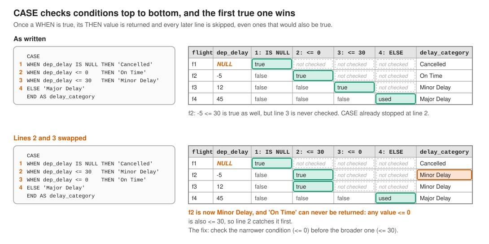
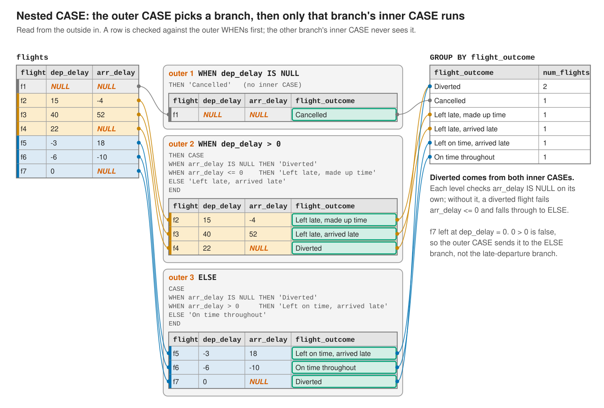

## Learning Objectives

By the end of this chapter, students will be able to:

- **Write** a searched `CASE WHEN` expression to produce a conditional column in query output.
- **Write** a simple `CASE` expression that compares a single value against a list of alternatives.
- **Construct** a nested `CASE` expression for multi-stage decisions, and rewrite it as an equivalent flat `CASE` using combined conditions.
- **Apply** `CASE WHEN` inside aggregate functions to compute conditional counts and sums in a single query.
- **Use** `COALESCE` to substitute a default value for `NULL` in query results.
- **Apply** `NULLIF` to return `NULL` when two expressions are equal, preventing division-by-zero errors.
- **Distinguish** between `COALESCE` (returns first non-null) and `NULLIF` (returns null on equality) and select the appropriate function for a given scenario.
- **Combine** `CASE WHEN` with `GROUP BY` to create custom categorical groupings from continuous or multi-valued columns.
- **Sort** custom categories in a meaningful order by using an aggregate function in `ORDER BY`, and explain why the underlying column cannot be used directly.
- **Evaluate** whether a conditional expression problem is best solved with `CASE WHEN`, `COALESCE`, or `NULLIF`.

```{r}
#| include: false
library(DBI)
library(RPostgres)

options(knitr.kable.NA = "NULL")
knitr::opts_chunk$set(max.print = 100)
knitr::opts_knit$set(sql.print = function(x) as.character(knitr::knit_print(rmarkdown::paged_table(x))))

con <- dbConnect(
  Postgres(),
  host     = "localhost",
  port     = as.integer(Sys.getenv("PGPORT", unset = "5432")),
  dbname   = "nycflights",
  user     = "postgres",
  password = Sys.getenv("PGPASS", unset = "postgres")
)
```

Every query so far has treated a column the same way for every row: `SELECT dep_delay` returns the same kind of value no matter which row produced it. Often you want the *output* to depend on the *data*: label a flight "Delayed" or "On Time" depending on its `dep_delay`, substitute a sensible default when a value is missing, or guard an expression against a value that would otherwise cause an error. SQL's conditional expressions, `CASE WHEN`, `COALESCE`, and `NULLIF`, let a query branch on the values it is looking at, without leaving the `SELECT` statement or filtering any rows out.

This chapter uses the `flights`, `airlines`, and `planes` tables from the `nycflights` database throughout.

## The Searched CASE Expression

A **searched `CASE` expression** evaluates a list of conditions in order and returns the result tied to the first one that is true:

```sql
CASE
    WHEN condition_1 THEN result_1
    WHEN condition_2 THEN result_2
    ...
    ELSE default_result
END
```

Each `WHEN` is checked top to bottom. As soon as one evaluates to true, its `THEN` result is returned and the rest are skipped, even if a later condition would also have matched. `ELSE` is optional; if it is omitted and no condition matches, the expression returns `NULL`.

Here is a `CASE WHEN` that labels each flight by how delayed it was:

```{sql}
--| connection: con
--| label: case-searched
SELECT
    carrier,
    flight,
    dep_delay,
    CASE
        WHEN dep_delay IS NULL THEN 'Cancelled'
        WHEN dep_delay <= 0    THEN 'On Time'
        WHEN dep_delay <= 30   THEN 'Minor Delay'
        ELSE 'Major Delay'
    END AS delay_category
FROM flights
ORDER BY dep_delay DESC NULLS LAST
LIMIT 10;
```

The conditions are checked in the order written, which matters here: a flight with `dep_delay = -5` fails the first `WHEN` (it is not `NULL`) but passes the second (`-5 <= 0`), so it is labeled `'On Time'` before the `'Minor Delay'` condition is ever checked. If the second and third conditions were swapped, every on-time flight would incorrectly match `<= 30` first. To avoid this trap, check the narrower condition (`<= 0`) before the broader one (`<= 30`).

{fig-alt="Four flights evaluated against CASE WHEN dep_delay IS NULL THEN 'Cancelled', WHEN dep_delay <= 0 THEN 'On Time', WHEN dep_delay <= 30 THEN 'Minor Delay', ELSE 'Major Delay'. Each flight is checked top to bottom and evaluation stops at the first true condition: f1 (NULL) is Cancelled at line 1, f2 (-5) is On Time at line 2 even though -5 <= 30 is also true, f3 (12) is Minor Delay at line 3, and f4 (45) falls through to ELSE, Major Delay. With lines 2 and 3 swapped, f2 becomes Minor Delay and 'On Time' can never be returned, because every value <= 0 is also <= 30." width="100%"}

`CASE` is an expression, not a statement: it produces a single value and can appear anywhere a column can, including inside `WHERE`, `ORDER BY`, or another expression.

## The Simple CASE Expression

When every branch is testing the *same* value for equality against a list of specific alternatives, SQL offers a shorter **simple `CASE` expression**:

```sql
CASE expression
    WHEN value_1 THEN result_1
    WHEN value_2 THEN result_2
    ...
    ELSE default_result
END
```

This is equivalent to a searched `CASE` where every condition is `expression = value_n`, but it only writes the expression once. It is well suited to recoding a small, known set of values, such as turning a numeric day-of-week into its name:

```{sql}
--| connection: con
--| label: case-simple
SELECT
    CASE EXTRACT(DOW FROM time_hour)
        WHEN 0 THEN 'Sunday'
        WHEN 1 THEN 'Monday'
        WHEN 2 THEN 'Tuesday'
        WHEN 3 THEN 'Wednesday'
        WHEN 4 THEN 'Thursday'
        WHEN 5 THEN 'Friday'
        WHEN 6 THEN 'Saturday'
    END AS day_of_week,
    COUNT(*) AS num_flights
FROM flights
GROUP BY day_of_week
ORDER BY num_flights DESC;
```

`EXTRACT(DOW FROM time_hour)` (introduced in the data types chapter) returns an integer from 0 (Sunday) to 6 (Saturday). The simple `CASE` matches that single value against each `WHEN`, exactly the way a switch statement works in most general-purpose programming languages. If you find yourself writing `WHEN x = 0`, `WHEN x = 1`, `WHEN x = 2` repeatedly with a searched `CASE`, the simple form is almost always the better fit.

## Nested CASE Expressions

Because `CASE` is an expression, the result in any `THEN` or `ELSE` branch can itself be another `CASE` expression. This is called a **nested `CASE`**, and it is useful when a decision naturally happens in stages: first split the rows on one question, then split each of those groups on a second question.

Suppose you want to describe each flight's whole journey, not just its departure. The first question is whether the flight left late. The second question depends on the answer to the first: for a late departure, did the pilot make up the time in the air? For an on-time departure, did the flight still arrive late?

```{sql}
--| connection: con
--| label: case-nested
SELECT
    CASE
        WHEN dep_delay IS NULL THEN 'Cancelled'
        WHEN dep_delay > 0 THEN
            CASE
                WHEN arr_delay IS NULL THEN 'Diverted'
                WHEN arr_delay <= 0    THEN 'Left late, made up time'
                ELSE 'Left late, arrived late'
            END
        ELSE
            CASE
                WHEN arr_delay IS NULL THEN 'Diverted'
                WHEN arr_delay > 0     THEN 'Left on time, arrived late'
                ELSE 'On time throughout'
            END
    END AS flight_outcome,
    COUNT(*) AS num_flights
FROM flights
GROUP BY flight_outcome
ORDER BY num_flights DESC;
```

Read a nested `CASE` from the outside in. The outer expression decides which branch a row belongs to, and only then does the inner `CASE` in that branch get evaluated. A flight with `dep_delay = 12` matches the outer `WHEN dep_delay > 0`, so SQL evaluates the first inner `CASE` and never looks at the second one. Each inner `CASE` needs its own `END`, and indenting each level consistently is the easiest way to keep track of which `END` closes which expression.

The inner `WHEN arr_delay IS NULL` checks handle diverted flights, which departed (so `dep_delay` has a value) but never arrived at their destination (so `arr_delay` is `NULL`). Without that check, a diverted flight would fail `arr_delay <= 0`, since any comparison with `NULL` is unknown rather than true, and it would fall through to `ELSE 'Left late, arrived late'`. Every level of a nested `CASE` has to account for `NULL` on its own.

The diagram below follows seven flights through the query above, including one diverted flight in each inner `CASE`:

{fig-alt="Seven flights go through the chapter's nested CASE. The outer CASE checks dep_delay and sends each flight to exactly one branch: f1 (dep_delay NULL) to Cancelled; f2, f3, and f4 (dep_delay > 0) to the first inner CASE; f5, f6, and f7 (dep_delay -3, -6, and 0) to the ELSE branch's inner CASE. Only that branch's inner CASE runs on a row. f2 made up time, f3 arrived late, and f4 has a NULL arr_delay, so it is Diverted. f5 arrived late, f6 was on time throughout, and f7 is Diverted. GROUP BY flight_outcome then counts the labels: Diverted 2, every other outcome 1." width="100%"}

### Nesting vs. Combining Conditions

Any nested `CASE` can be rewritten as a single, flat `CASE` by combining the outer and inner conditions with `AND`. This query produces exactly the same result as the one above:

```{sql}
--| connection: con
--| label: case-nested-flat
SELECT
    CASE
        WHEN dep_delay IS NULL                THEN 'Cancelled'
        WHEN arr_delay IS NULL                THEN 'Diverted'
        WHEN dep_delay > 0 AND arr_delay <= 0 THEN 'Left late, made up time'
        WHEN dep_delay > 0                    THEN 'Left late, arrived late'
        WHEN arr_delay > 0                    THEN 'Left on time, arrived late'
        ELSE 'On time throughout'
    END AS flight_outcome,
    COUNT(*) AS num_flights
FROM flights
GROUP BY flight_outcome
ORDER BY num_flights DESC;
```

The flat version is shorter here, and it only has to check for diverted flights once. It also leans heavily on top-to-bottom evaluation: `WHEN dep_delay > 0` on the fourth line only means "left late and arrived late" because the line above it already caught the late departures that made up time. The nested version makes that two-step logic visible in its structure instead of leaving the reader to infer it from the ordering.

Neither form is always better. Nesting tends to read more clearly when the outer split is the main decision and each branch asks a different follow-up question. A flat `CASE` tends to read more clearly when the conditions are short and the branches share checks, as the diverted-flight check does here. If you find yourself three or more levels deep, that is usually a sign the logic would be easier to follow flattened, or broken into steps with a CTE (covered in the next chapter).

## CASE WHEN Inside Aggregate Functions

The aggregating chapter introduced the `FILTER` clause for computing more than one conditional summary in a single query, and mentioned in passing that `CASE WHEN` is the portable equivalent for databases that do not support `FILTER`. It is worth seeing that pattern in full, because it comes up constantly and because it reveals a useful property of aggregate functions: they ignore `NULL`.

```{sql}
--| connection: con
--| label: case-in-aggregate
SELECT
    carrier,
    COUNT(*)                                         AS total_flights,
    COUNT(CASE WHEN dep_delay > 0 THEN 1 END)         AS delayed_flights,
    SUM(CASE WHEN dep_delay > 0 THEN dep_delay ELSE 0 END) AS total_delay_minutes
FROM flights
GROUP BY carrier
ORDER BY delayed_flights DESC
LIMIT 5;
```

`COUNT(CASE WHEN dep_delay > 0 THEN 1 END)` has no `ELSE`, so every row that does not satisfy the condition produces `NULL` instead of a value. `COUNT()` only counts non-`NULL` inputs, so those rows are silently skipped, and the result is exactly the count of delayed flights per carrier. This is a common and deliberate idiom: omitting `ELSE` to let `COUNT` do the filtering.

`SUM`, by contrast, needs an explicit `ELSE 0`. `SUM` also ignores `NULL` inputs, but here every row should contribute *something* to the running total, zero for on-time flights and the actual delay for late ones, so the `ELSE 0` is required to keep those rows in the sum rather than dropping them out of it.

## COALESCE: Substituting a Default for NULL

`COALESCE(expr_1, expr_2, ..., expr_n)` evaluates its arguments left to right and returns the first one that is not `NULL`. If every argument is `NULL`, the result is `NULL`.

The `planes` table records a cruising `speed` for very few aircraft:

```{sql}
--| connection: con
--| label: coalesce-missing-speed
SELECT
    COUNT(*)          AS total_planes,
    COUNT(speed)       AS planes_with_recorded_speed
FROM planes;
```

Most rows have no recorded speed at all. If a later calculation needs *some* speed value for every plane (say, to estimate flight duration), `COALESCE` can fall back to a reasonable assumption when the real value is missing:

```{sql}
--| connection: con
--| label: coalesce-basic
SELECT
    tailnum,
    manufacturer,
    model,
    COALESCE(speed, 260) AS assumed_speed_mph
FROM planes
ORDER BY tailnum
LIMIT 5;
```

Every row here has a `NULL` `speed`, so every row falls back to the assumed default of 260 mph. For the handful of planes that *do* have a recorded speed, `COALESCE` would return that real value instead, since it is the first non-`NULL` argument. `COALESCE` can take more than two arguments, trying each in turn: `COALESCE(a, b, c)` returns `a` if it is not `NULL`, otherwise `b` if it is not `NULL`, otherwise `c`.

## NULLIF: Producing NULL on Equality

`NULLIF(expr_1, expr_2)` is close to the opposite of `COALESCE`. It compares two expressions and returns `NULL` if they are equal, or the first expression's value if they are not.

```sql
NULLIF(expr_1, expr_2)
```

Its most common use is guarding a division against a zero denominator, since dividing by zero raises an error in SQL rather than returning infinity:

```{sql}
--| connection: con
--| label: nullif-division
SELECT
    carrier,
    COUNT(*) AS total_flights,
    COUNT(CASE WHEN dep_delay > 0 THEN 1 END) AS delayed_flights,
    ROUND(
        COUNT(CASE WHEN dep_delay > 0 THEN 1 END)::numeric
        / NULLIF(COUNT(*), 0),
        3
    ) AS pct_delayed
FROM flights
GROUP BY carrier
ORDER BY pct_delayed DESC
LIMIT 5;
```

`NULLIF(COUNT(*), 0)` returns `NULL` whenever a carrier has zero flights in the group, which turns the division into `something / NULL`. In SQL, any arithmetic operation involving `NULL` produces `NULL`, so `pct_delayed` comes back `NULL` for that row instead of raising a division-by-zero error. No carrier in this dataset actually has a zero-flight group, but the guard costs nothing to include and prevents the query from breaking the moment a filtered or grouped result set produces an empty group. This is a defensive habit worth building now, before it is the difference between a finished report and a crashed pipeline.

## COALESCE vs. NULLIF

The two functions solve opposite problems and are easy to mix up on a first encounter:

| Function | Question it answers | Direction |
|---|---|---|
| `COALESCE(a, b, ...)` | "This value might be `NULL`. What should I use instead?" | Fills a `NULL` in with something else |
| `NULLIF(a, b)` | "This value is real, but if it equals something specific, I want to treat it as missing." | Turns a real value into `NULL` |

A useful way to keep them straight: `COALESCE` is what you reach for when `NULL` is already a problem in your data. `NULLIF` is what you reach for when a real value (often `0`) would *cause* a problem if you did not treat it as missing first. They are sometimes used together: `COALESCE(NULLIF(price, 0), average_price)` first converts a `0` price into `NULL`, then falls back to an average, treating "priced at zero" the same way as "no price recorded."

## Building Custom Categories with CASE WHEN and GROUP BY

`CASE WHEN` and `GROUP BY` combine to create categories that do not exist as columns in the table. This is the pattern behind the delay-severity buckets from the first section, now used to actually group and summarize:

```{sql}
--| connection: con
--| label: case-group-by
SELECT
    CASE
        WHEN dep_delay IS NULL THEN 'Cancelled'
        WHEN dep_delay <= 0    THEN 'On Time'
        WHEN dep_delay <= 30   THEN 'Minor Delay'
        ELSE 'Major Delay'
    END AS delay_category,
    COUNT(*) AS num_flights
FROM flights
GROUP BY delay_category
ORDER BY num_flights DESC;
```

PostgreSQL allows `GROUP BY` to reference the output alias (`delay_category`) rather than repeating the full `CASE` expression, which is what happens above. This is a convenience, not a universal rule: some databases require the entire `CASE` expression to be repeated in the `GROUP BY` clause, since grouping happens logically before column aliases are assigned. If you want a query that works unmodified across database systems, repeat the full expression in both places instead of relying on the alias.

This pattern, inventing categories on the fly with `CASE WHEN` and grouping by them, is one of the most frequently used techniques in analytical SQL. It turns a continuous measurement like `dep_delay` into whatever discrete buckets are useful for the question at hand, without needing to add a new column to the table.

### Sorting Custom Categories

The query above sorts the buckets by how many flights they contain. Often you want them in their *natural* order instead: from on time, through minor and major delays, the way the buckets were defined. The obvious first attempt is to sort by the category itself:

```{sql}
--| connection: con
--| label: case-sort-by-label
SELECT
    CASE
        WHEN dep_delay IS NULL THEN 'Cancelled'
        WHEN dep_delay <= 0    THEN 'On Time'
        WHEN dep_delay <= 30   THEN 'Minor Delay'
        ELSE 'Major Delay'
    END AS delay_category,
    COUNT(*) AS num_flights
FROM flights
GROUP BY delay_category
ORDER BY delay_category;
```

The labels are text, so `ORDER BY` sorts them alphabetically, and "Major Delay" lands ahead of "Minor Delay" only because *a* comes before *i*. Alphabetical order has nothing to do with the order the buckets represent. It can be worse with numeric labels: `'$15 and up'` sorts ahead of `'$5 - $14.99'`, because text comparison looks at the character `'1'` before it ever considers how many digits follow.

The second attempt is to sort by the column the buckets were built from:

```sql
SELECT
    CASE
        WHEN dep_delay IS NULL THEN 'Cancelled'
        WHEN dep_delay <= 0    THEN 'On Time'
        WHEN dep_delay <= 30   THEN 'Minor Delay'
        ELSE 'Major Delay'
    END AS delay_category,
    COUNT(*) AS num_flights
FROM flights
GROUP BY delay_category
ORDER BY dep_delay;
```

```
ERROR:  column "flights.dep_delay" must appear in the GROUP BY clause or be used in an aggregate function
```

This is the same rule the aggregating chapter described for `SELECT`, and it applies to `ORDER BY` for the same reason. `ORDER BY` runs after `GROUP BY`, and by then each output row stands for an entire bucket of flights. The "Minor Delay" row contains 20,554 different `dep_delay` values, so there is no single `dep_delay` to sort it by.

The error message also points to the fix. An aggregate function collapses all of a bucket's values into one, and that one value is something `ORDER BY` *can* sort on:

```{sql}
--| connection: con
--| label: case-sort-by-min
SELECT
    CASE
        WHEN dep_delay IS NULL THEN 'Cancelled'
        WHEN dep_delay <= 0    THEN 'On Time'
        WHEN dep_delay <= 30   THEN 'Minor Delay'
        ELSE 'Major Delay'
    END AS delay_category,
    COUNT(*) AS num_flights
FROM flights
GROUP BY delay_category
ORDER BY MIN(dep_delay);
```

Notice that `MIN(dep_delay)` never appears in the `SELECT` list. `ORDER BY` is free to compute its own aggregate for each group, whether or not that value is displayed. To see why this aggregate produces the right order, here is the same query with each bucket's smallest and largest delay shown alongside it:

```{sql}
--| connection: con
--| label: case-sort-by-min-shown
SELECT
    CASE
        WHEN dep_delay IS NULL THEN 'Cancelled'
        WHEN dep_delay <= 0    THEN 'On Time'
        WHEN dep_delay <= 30   THEN 'Minor Delay'
        ELSE 'Major Delay'
    END AS delay_category,
    COUNT(*)       AS num_flights,
    MIN(dep_delay) AS min_delay,
    MAX(dep_delay) AS max_delay
FROM flights
GROUP BY delay_category
ORDER BY MIN(dep_delay);
```

Each bucket covers its own stretch of the number line, and the stretches do not overlap: everything in "On Time" is at most 0, everything in "Minor Delay" falls between 1 and 30, and everything in "Major Delay" is 31 or more. Because of that, sorting the buckets by their smallest values sorts them in the same order as the ranges they cover. There is nothing special about `MIN` here. `MAX(dep_delay)` or `AVG(dep_delay)` would produce the same order, since any value that comes from inside a bucket's range lines up with the other buckets the same way.

The "Cancelled" bucket is the exception. Every row in it has a `NULL` `dep_delay`, so its minimum is `NULL` too, and PostgreSQL sorts `NULL` after every other value in ascending order. That happens to be a reasonable place for cancelled flights. If you would rather see them first, add `NULLS FIRST`, just as you would for any other sort:

```{sql}
--| connection: con
--| label: case-sort-nulls-first
SELECT
    CASE
        WHEN dep_delay IS NULL THEN 'Cancelled'
        WHEN dep_delay <= 0    THEN 'On Time'
        WHEN dep_delay <= 30   THEN 'Minor Delay'
        ELSE 'Major Delay'
    END AS delay_category,
    COUNT(*) AS num_flights
FROM flights
GROUP BY delay_category
ORDER BY MIN(dep_delay) NULLS FIRST;
```

#### When the Categories Are Not Ranges

Sorting by `MIN` only works when the buckets are ranges of a single column. The `flight_outcome` categories from the nested `CASE` section depend on two columns, `dep_delay` and `arr_delay`, so neither column's minimum puts them in a meaningful order. In that situation you have to state the order yourself by giving each category an explicit rank.

You might try to write that rank as a simple `CASE` on the alias:

```sql
ORDER BY CASE flight_outcome
    WHEN 'On time throughout' THEN 1
    ...
END
```

PostgreSQL rejects this with `column "flight_outcome" does not exist`. It allows an output alias in `ORDER BY` only when the alias appears on its own, not inside a larger expression. The workaround is to compute the rank from the original columns, using a second `CASE` with the same conditions as the first, and to wrap it in an aggregate so that it satisfies the `GROUP BY` rule:

```{sql}
--| connection: con
--| label: case-sort-explicit-rank
SELECT
    CASE
        WHEN dep_delay IS NULL                THEN 'Cancelled'
        WHEN arr_delay IS NULL                THEN 'Diverted'
        WHEN dep_delay > 0 AND arr_delay <= 0 THEN 'Left late, made up time'
        WHEN dep_delay > 0                    THEN 'Left late, arrived late'
        WHEN arr_delay > 0                    THEN 'Left on time, arrived late'
        ELSE 'On time throughout'
    END AS flight_outcome,
    COUNT(*) AS num_flights
FROM flights
GROUP BY flight_outcome
ORDER BY MIN(
    CASE
        WHEN dep_delay IS NULL                THEN 6
        WHEN arr_delay IS NULL                THEN 5
        WHEN dep_delay > 0 AND arr_delay <= 0 THEN 2
        WHEN dep_delay > 0                    THEN 4
        WHEN arr_delay > 0                    THEN 3
        ELSE 1
    END
);
```

Because the second `CASE` uses the same conditions as the first, every row in a group gets the same rank, and `MIN` simply pulls that one shared value out of the group. This works, but repeating the logic is clumsy: if you change a condition in one `CASE` and forget the other, the labels and the ranks quietly disagree. The next chapter introduces CTEs, which let you compute the category once and then sort or rank it in a separate step.

## Choosing the Right Tool

All three tools covered in this chapter branch on data, but they answer different questions:

- Reach for **`CASE WHEN`** when you need to produce a different *label or value* depending on one or more conditions, whether for direct output, for building a category to group by, or for computing a conditional aggregate.
- Reach for **`COALESCE`** when the concern is specifically `NULL`, and you want a fallback value in its place.
- Reach for **`NULLIF`** when a specific real value (commonly `0` or an empty string) should be treated as equivalent to missing, usually to protect a downstream calculation like division.

In practice these tools compose. A `CASE WHEN` can contain a `COALESCE`, a `COALESCE` can wrap a `NULLIF`, and any of them can appear inside an aggregate function. Reading a complex expression from the inside out, and asking "what problem is this specific piece solving," is the most reliable way to make sense of it.

## Exercises {.unnumbered}

### Reflection {.unnumbered}

**1.** In your own words, explain why `COUNT(CASE WHEN condition THEN 1 END)` works without an `ELSE` clause, while `SUM(CASE WHEN condition THEN value ELSE 0 END)` requires one.

---

**2.** A classmate writes `NULLIF(price, 0)` and expects it to return `0` when `price` is `0`. Explain what it actually returns, and why.

---

**3.** Describe a scenario, not covered in this chapter, where you would use `COALESCE`, and a different scenario where you would use `NULLIF`. Explain what problem each one solves in your example.

---

### Practical {.unnumbered}

**4.** Write a query against `flights` that uses a searched `CASE WHEN` to label each flight's `arr_delay` as `'Early'` (less than 0), `'On Time'` (0), `'Late'` (greater than 0), or `'Unknown'` (`NULL`). Show `carrier`, `flight`, `arr_delay`, and the new label for 10 rows.

---

**5.** Using `planes`, write a query with a simple `CASE` expression that recodes the `engine` column into three friendlier categories of your choosing (for example, grouping several turbine variants together). Count how many planes fall into each category.

---

**6.** Using `flights`, write a nested `CASE` expression whose outer level checks whether a flight's `distance` is greater than 1,000 miles (`'Long-haul'`) or not (`'Short-haul'`), and whose inner level labels each flight within those groups as `'Delayed'` or `'Not delayed'` based on `dep_delay`. Produce combined labels such as `'Long-haul, Delayed'`, and count how many flights fall into each label. Then rewrite the query as a single flat `CASE` and confirm that both versions return the same counts. Which version do you find easier to read, and why?

---

**7.** Write a query that computes, for each carrier, the number of flights with `air_time` longer than 180 minutes and the number with `air_time` of 180 minutes or less, using `CASE WHEN` inside `COUNT()`. Handle `NULL` `air_time` values explicitly and explain in a comment which category they fall into and why.

---

**8.** The `planes` table's `engines` column is never `NULL`, but suppose a future data load introduced planes with a missing `engines` value. Write a query that uses `COALESCE` to treat a missing `engines` value as `1` when computing the total number of engines across all planes with `SUM(COALESCE(engines, 1))`.

---

**9.** Write a query that computes the percentage of cancelled flights (`dep_delay IS NULL`) for each origin airport in `flights`, using `NULLIF` to guard against a division by zero. Even though this dataset has only one origin airport, write the query as though it might not.

---

**10.** Using `flights`, write a `CASE WHEN` expression that buckets each flight's `distance` as `'Under 250 miles'`, `'250 - 499 miles'`, `'500 - 999 miles'`, or `'1,000 miles and up'`. Count the flights in each bucket and sort the results from the shortest bucket to the longest. Then explain why `ORDER BY distance` raises an error here, and why `ORDER BY MAX(distance)` would produce the same order as `ORDER BY MIN(distance)`.
