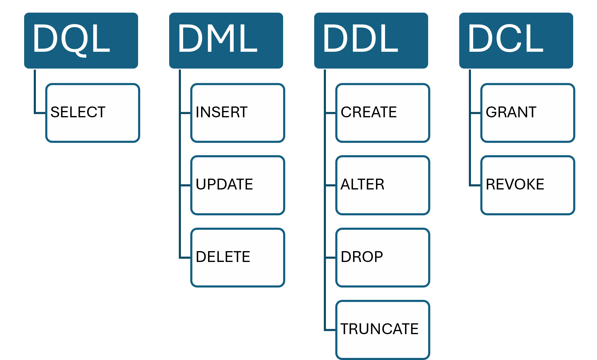

## Learning Objectives

By the end of this chapter, students will be able to:

- **Write** `CREATE TABLE` statements with appropriate column names, data types, and inline constraints.
- **Apply** `NOT NULL`, `UNIQUE`, `DEFAULT`, and `CHECK` constraints when defining columns.
- **Use** `ALTER TABLE` to add, drop, or modify columns and constraints on an existing table.
- **Write** `DROP TABLE` and `TRUNCATE TABLE` and explain the difference in behavior and reversibility.
- **Use** `CREATE TABLE AS SELECT` to persist query results as a new permanent table.
- **Define** an auto-incrementing primary key column using `GENERATED ALWAYS AS IDENTITY`.
- **Distinguish** between a temporary table and a permanent table and identify appropriate use cases for each.

```{r}
#| include: false
library(DBI)
library(RPostgres)

options(knitr.kable.NA = "NULL")
knitr::opts_chunk$set(max.print = 100)
knitr::opts_knit$set(sql.print = function(x) as.character(knitr::knit_print(rmarkdown::paged_table(x))))

PGPORT <- as.integer(Sys.getenv("PGPORT", unset = "5432"))
PGPASS <- Sys.getenv("PGPASS", unset = "postgres")

con_admin <- dbConnect(Postgres(),
  host = "localhost", port = PGPORT,
  dbname = "postgres", user = "postgres", password = PGPASS
)
tryCatch(
  dbExecute(con_admin, "CREATE DATABASE university"),
  error = function(e) NULL
)
dbDisconnect(con_admin)

con <- dbConnect(Postgres(),
  host = "localhost", port = PGPORT,
  dbname = "university", user = "postgres", password = PGPASS
)

dbExecute(con, "DROP TABLE IF EXISTS cohort_summary CASCADE")
dbExecute(con, "DROP TABLE IF EXISTS students CASCADE")
```

## The SQL Family

Every query in this book so far has been a `SELECT` statement: reading data from tables that already exist. But there are many more SQL commands for us to cover, and their capabilities range from the creative to the destructive. With these, you can bring databases to life and keep them secure, or you can utterly demolish them. Sounds like fun, right?

This is where I begin to familiarize you with these other SQL commands and their capabilities so you can build databases from scratch and populate them. It's also where we begin to take your growing knowledge of normalization and apply it to the design of new database systems.

For the purposes of this textbook, we will classify SQL commands under four categories or families:

### Data Query Language (DQL)

This category is used to retrieve data from the database. `SELECT` is the only kind of command we see in DQL. It is used with clauses like `FROM`, `WHERE`, `GROUP BY`, etc., to shape its output, but those are not separate commands.

### Data Manipulation Language (DML)

This category is used to modify the data that is stored in the database. If you're familiar with CRUD operations, think of this is CRUD without the "R" (`SELECT` is the "R"). `INSERT`, `UPDATE`, and `DELETE` are prominent examples of DML commands you'll use.

Like `SELECT`, these commands can also be used with supporting clauses like `FROM` and `WHERE` to make sure you only manipulate the data you intend to manipulate.

As you can imagine, these are potentially destructive commands that can overwrite or destroy your data. But fret not, because these commands are often used in conjunction with another group of SQL commands known as TCL (Transaction Control Language) to safely manage the data manipulation and ensure we can "undo" any accidents. We'll cover this in our upcoming chapter on DML statements.

### Data Definition Language (DDL)

These are the commands we use to create and modify database objects like tables. These have the capability to define and alter the very structure of your database itself through operations like `CREATE`, `ALTER`, `DROP`, and `TRUNCATE`. These are also potentially highly destructive commands in your database, so they should be employed with care.

### Data Control Language (DCL)

This final category of SQL commands is used to secure our database by controlling access and other privileges through commands like `GRANT` and `REVOKE`. It's not as sexy as the other categories, perhaps, but it's essential for robust database design.



### Data-level operations vs. structural changes

Broadly speaking, SQL commands can be subdivided into two main groups: commands that make structural changes to the database, and commands that operate on the data itself. You're probably noticing that DQL and DML are distinct from DDL and DCL in that they only perform operations against the data, whereas the other commands can physically alter the database schema. Notice also how DQL and DML commands share the same supporting clauses with DML commands, such as `FROM` and `WHERE`.

For these reasons, if you consult the ANSI/ISO definitions, you'll see that `SELECT` is traditionally classified as a DML command because it operates on the data itself rather than the structure of the database. In fact, you can actually use DML statements like `SELECT ... INTO` to take the results of a `SELECT` command and insert them directly into a table.

That's probably confusing for SQL newcomers because I'm telling you that `SELECT` is both a DQL command *and* a DML command. But technically it's true. The distinction between DQL and DML largely came about from a desire to pedagogically separate **read-only** operations like `SELECT` from **write-intent** operations like `INSERT`, `UPDATE`, and `DELETE`, the commands that we use to mutate data.

So, if you accept the broad view that `SELECT` belongs with its siblings whose only job is to perform operations agaisnt the data, then you can see why it qualifies as a DML command. But, if you want to get more precise, you can split it out into its own DQL category to honor the separation between read-only commands and write-intent commands.

This chapter and the ones following it will introduce you to DDL and DML commands in SQL by challenging you to create new databases, as well as add and modify data in them. In this chapter specifically, we'll focus on `CREATE TABLE`, the fundamental DDL statement, in the context of building a university database from scratch. By the end, you will know how to create a database, define a table with appropriate constraints, prevent duplicate or invalid data at the schema level, and modify a table's structure after the fact. A later chapter extends this foundation to multi-table schemas with foreign keys.

## Creating a Database

In PostgreSQL, a **database** is the top-level container: an isolated environment with its own tables, schemas, users, and settings. A running server can host multiple databases simultaneously. The `worldbank` database you have been querying throughout this book is one such database on your local Docker container. Here, you will create a second one.

```sql
CREATE DATABASE university;
```

::: {.callout-note}
`CREATE DATABASE` must be run while connected to a *different* database: you cannot create a database while you are connected to it. Open a new query window in your IDE connected to the built-in `postgres` maintenance database, and run the statement there:

```sql
CREATE DATABASE university;
```

Once that succeeds, open another new query window, this time connected to `university`, and use that one for everything that follows.
:::

Once connected to `university`, every `CREATE TABLE` statement you run will place its tables there, completely separate from `worldbank`.

## Schemas

Within a database, a **schema** is a named namespace that groups related objects (tables, views, functions) together. Think of a database as a building and schemas as the floors inside it.

Every PostgreSQL database starts with a schema called `public`. When you create a table without specifying a schema, it lands in `public` by default:

```sql
-- These two are equivalent
CREATE TABLE students (...);
CREATE TABLE public.students (...);
```

You can create additional schemas to separate concerns: for example, a `registrar` schema for enrollment data and an `finance` schema for billing tables. Tables outside the default schema are referenced with a **schema-qualified name**: `schema_name.table_name`. The `search_path` setting controls which schemas PostgreSQL searches when you use an unqualified name.

For the exercises in this chapter, the `public` schema of the `university` database is sufficient. Schemas become more important when a single database serves multiple applications or teams, a pattern covered in the chapter on building a schema.

## Basic Syntax

```sql
CREATE TABLE table_name (
    column_name  data_type  [column_constraints],
    column_name  data_type  [column_constraints],
    ...
    [table_constraints]
);
```

Each column is defined by its name, its data type (covered in the data types chapter), and any constraints that apply to it. Constraints tell the database what values are and are not acceptable, enforcing business rules at the storage level regardless of which application or user touches the data.

## Column Constraints

### NOT NULL

`NOT NULL` prevents a column from ever holding a NULL value. It is the most common constraint after the primary key.

```sql
CREATE TABLE students (
    student_id   INTEGER  GENERATED ALWAYS AS IDENTITY  PRIMARY KEY,
    first_name   TEXT    NOT NULL,
    last_name    TEXT    NOT NULL
);
```

Any `INSERT` or `UPDATE` that leaves `first_name` or `last_name` as NULL will be rejected immediately by the database.

### DEFAULT

A `DEFAULT` value is substituted automatically when an `INSERT` statement omits the column entirely.

```sql
CREATE TABLE students (
    student_id      INTEGER  GENERATED ALWAYS AS IDENTITY   PRIMARY KEY,
    first_name      TEXT     NOT NULL,
    last_name       TEXT     NOT NULL,
    enrolled_on     DATE     NOT NULL DEFAULT CURRENT_DATE,
    is_active       BOOLEAN  NOT NULL DEFAULT TRUE
);
```

If a new row is inserted without specifying `enrolled_on`, the database records the current date. A default is not the same as `NOT NULL`: a column can have a default and still accept an explicitly supplied NULL, unless `NOT NULL` is also present.

### UNIQUE

`UNIQUE` ensures no two rows share the same value in that column. A student's email address is a natural candidate, since each address should appear at most once.

```sql
CREATE TABLE students (
    student_id   INTEGER  GENERATED ALWAYS AS IDENTITY  PRIMARY KEY,
    first_name   TEXT    NOT NULL,
    last_name    TEXT    NOT NULL,
    email        TEXT    NOT NULL UNIQUE,
    enrolled_on  DATE    NOT NULL DEFAULT CURRENT_DATE,
    is_active    BOOLEAN NOT NULL DEFAULT TRUE
);
```

`PRIMARY KEY` already implies both uniqueness and non-nullability, so you do not add `UNIQUE` or `NOT NULL` to a primary key column separately.

::: {.callout-note}
PostgreSQL permits multiple NULL values in a `UNIQUE` column because NULL is not considered equal to NULL, so no uniqueness violation occurs. If a non-key column must be both unique and present in every row, declare both `UNIQUE` and `NOT NULL`.
:::

### CHECK

A `CHECK` constraint specifies a boolean condition that every row must satisfy. GPA values, for example, should fall within a defined range:

```sql
CREATE TABLE students (
    student_id   INTEGER  GENERATED ALWAYS AS IDENTITY        PRIMARY KEY,
    first_name   TEXT          NOT NULL,
    last_name    TEXT          NOT NULL,
    email        TEXT          NOT NULL UNIQUE,
    enrolled_on  DATE          NOT NULL DEFAULT CURRENT_DATE,
    is_active    BOOLEAN       NOT NULL DEFAULT TRUE,
    gpa          NUMERIC(3, 2) CHECK (gpa IS NULL OR (gpa >= 0.0 AND gpa <= 4.0))
);
```

`CHECK` constraints are evaluated on every `INSERT` and `UPDATE`. The `gpa IS NULL` clause is necessary because a CHECK constraint only fails when it evaluates to FALSE: a NULL result is treated as passing. Allowing NULL here is intentional: a newly enrolled student may not yet have a GPA on record.

## Primary Keys

The keys and integrity chapter introduced primary keys as a design concept. In SQL, the `PRIMARY KEY` constraint is how you enforce that concept.

### Single-Column Primary Key

The simplest form declares `PRIMARY KEY` inline with the column definition:

```sql
CREATE TABLE students (
    student_id  INTEGER  GENERATED ALWAYS AS IDENTITY  PRIMARY KEY,
    ...
);
```

`PRIMARY KEY` implies both `NOT NULL` and `UNIQUE`, so neither needs to be written separately. `GENERATED ALWAYS AS IDENTITY` tells PostgreSQL to generate the column's value automatically, backed by a sequence: each new row receives the next integer if no value is supplied. This is the SQL standard way to create a surrogate primary key, supported in PostgreSQL 10 and later, and is what we'll use throughout this book.

::: {.callout-note}
You will also encounter `SERIAL` in older PostgreSQL code and documentation:

```sql
student_id  SERIAL  PRIMARY KEY
```

This is a PostgreSQL-specific convenience type that predates `GENERATED ALWAYS AS IDENTITY` and accomplishes the same thing. It still works, but `GENERATED ALWAYS AS IDENTITY` is the modern, standard-SQL form and the one you should reach for in new code.
:::

### Composite Primary Keys

When no single column uniquely identifies a row, two or more columns can serve as the primary key together. A composite key is written as a **table-level constraint** after the column definitions:

```sql
CREATE TABLE enrollments (
    student_id  INTEGER  NOT NULL,
    course_id   INTEGER  NOT NULL,
    semester    TEXT     NOT NULL,
    PRIMARY KEY (student_id, course_id, semester)
);
```

Inline `PRIMARY KEY` syntax cannot express a composite key. The full multi-table schema, including this `enrollments` table and the foreign keys that connect it to `students` and `courses`, is built out in the chapter on building a schema.

## Putting It Together: The Students Table

Here is the complete `students` table definition, bringing all the constraints above into a single statement:

```{sql}
--| connection: con
--| output: false
CREATE TABLE students (
    student_id   INTEGER  GENERATED ALWAYS AS IDENTITY        PRIMARY KEY,
    first_name   TEXT          NOT NULL,
    last_name    TEXT          NOT NULL,
    email        TEXT          NOT NULL UNIQUE,
    enrolled_on  DATE          NOT NULL DEFAULT CURRENT_DATE,
    is_active    BOOLEAN       NOT NULL DEFAULT TRUE,
    gpa          NUMERIC(3, 2) CHECK (gpa IS NULL OR (gpa >= 0.0 AND gpa <= 4.0))
)
```

Insert a few rows to verify the table works:

```{sql}
--| connection: con
--| output: false
INSERT INTO students (first_name, last_name, email, enrolled_on, gpa)
VALUES
    ('Maria',  'Santos',  'msantos@university.edu',  '2023-08-28', 3.85),
    ('James',  'Okafor',  'jokafor@university.edu',  '2023-08-28', 3.41),
    ('Priya',  'Nair',    'pnair@university.edu',    '2024-01-15', NULL),
    ('Connor', 'Walsh',   'cwalsh@university.edu',   '2024-01-15', 2.97)
```

```{sql}
--| connection: con
SELECT * FROM students
```

Priya's GPA is NULL: she enrolled mid-year and has not yet completed any graded coursework. The CHECK constraint permits this because it was written to allow NULLs explicitly.

## CREATE TABLE IF NOT EXISTS

Running `CREATE TABLE` against a table that already exists produces an error. The `IF NOT EXISTS` modifier suppresses that error, making the statement safe to run in a script that may execute more than once:

```sql
CREATE TABLE IF NOT EXISTS students (
    student_id   INTEGER  GENERATED ALWAYS AS IDENTITY        PRIMARY KEY,
    first_name   TEXT          NOT NULL,
    last_name    TEXT          NOT NULL,
    email        TEXT          NOT NULL UNIQUE,
    enrolled_on  DATE          NOT NULL DEFAULT CURRENT_DATE,
    is_active    BOOLEAN       NOT NULL DEFAULT TRUE,
    gpa          NUMERIC(3, 2) CHECK (gpa IS NULL OR (gpa >= 0.0 AND gpa <= 4.0))
);
```

If `students` already exists, this statement does nothing and raises no error. This is the pattern used in setup scripts and database migrations.

## Creating a Table from a Query

Every `CREATE TABLE` statement so far has spelled out its columns one by one. Sometimes you already have a query whose result you want to keep, and writing out the columns by hand would only repeat what the query already says. `CREATE TABLE ... AS`, usually shortened to **CTAS** (for `CREATE TABLE AS SELECT`), creates a new table and fills it with a query's result in a single statement.

You have seen this form once already. The [Temporary Tables](temporary-tables.qmd) chapter used `CREATE TEMPORARY TABLE ... AS` to stage an intermediate result for one session. Leave out `TEMPORARY` and the result becomes a permanent table: visible to every session and kept until someone drops it.

The query can be any `SELECT`, including one with filters, joins, or aggregation. Here, it summarizes the `students` table by enrollment date:

```{sql}
--| connection: con
--| output: false
CREATE TABLE cohort_summary AS
SELECT enrolled_on,
       COUNT(*)           AS num_students,
       ROUND(AVG(gpa), 2) AS avg_gpa
FROM students
GROUP BY enrolled_on
```

```{sql}
--| connection: con
SELECT * FROM cohort_summary ORDER BY enrolled_on
```

The new table's column names come from the query's select list, which is why the aliases matter. Without them, PostgreSQL would name the computed columns `count` and `round`, which say nothing about what they hold. Always alias every computed column in a CTAS query.

### What CTAS does not copy

CTAS gives each column a data type based on the expression that produced it. That is *all* it infers. Query the new table's columns in `information_schema.columns` to see what it came away with:

```{sql}
--| connection: con
SELECT column_name, data_type, is_nullable
FROM information_schema.columns
WHERE table_name = 'cohort_summary'
ORDER BY ordinal_position
```

Every column is nullable, and `cohort_summary` has no primary key. The same is true when the query reads straight from a table with `SELECT *`. CTAS copies column names, data types, and rows. It does *not* copy the source table's `PRIMARY KEY`, `GENERATED ALWAYS AS IDENTITY`, `NOT NULL`, `UNIQUE`, `CHECK`, `DEFAULT`, or foreign key constraints. A copy of `students` made this way would happily accept two rows with the same `email` or a GPA of 5.0.

That makes CTAS a good fit for snapshots, reporting tables, and other results you mostly read from. If the new table will take new rows that need to follow the same rules as the original, add the constraints afterward with `ALTER TABLE`, or define the table with a full `CREATE TABLE` statement and fill it with `INSERT INTO ... SELECT`, covered in the chapter on [Data Manipulation](data-manipulation.qmd).

::: {.callout-note}
To copy a table's structure *including* its constraints, PostgreSQL offers `LIKE` inside an ordinary `CREATE TABLE` statement:

```sql
CREATE TABLE students_archive (LIKE students INCLUDING ALL);
```

This creates an empty table with the same columns, defaults, identity column, and constraints as `students`, but none of its rows. `INCLUDING ALL` is what brings most of that along. On its own, `LIKE students` copies only the columns and their `NOT NULL` constraints. Foreign keys are never copied, even with `INCLUDING ALL`.
:::

Always remember: a table created with CTAS holds the query's result *as of the moment it ran*. If a new student enrolls tomorrow, `cohort_summary` will not change. To bring it up to date, you drop the table and run the CTAS statement again. If you want a saved query that always reflects the current data, you can create a **view**, which is covered in the [Views](views.qmd) chapter.

Two variations are worth knowing:

- `CREATE TABLE IF NOT EXISTS cohort_summary AS ...` does nothing if the table already exists, just like the `IF NOT EXISTS` form above.
- Adding `WITH NO DATA` to the end of the statement creates the table's columns from the query without inserting any rows. This is a quick way to get an empty table shaped like a query's result.

::: {.callout-note}
Earlier in this chapter, I mentioned that `SELECT ... INTO` can write a query's result into a table. In PostgreSQL, `SELECT * INTO new_table FROM old_table` is an older way to write the same thing as CTAS, and you will see it in existing code. The PostgreSQL documentation recommends `CREATE TABLE ... AS` instead, because `SELECT INTO` means something different inside PostgreSQL functions, and because CTAS supports options such as `IF NOT EXISTS` and `WITH NO DATA`.
:::

## Removing Tables

`DROP TABLE` removes a table and all of its data permanently:

```sql
DROP TABLE students;
```

`DROP TABLE IF EXISTS` is the complement to `CREATE TABLE IF NOT EXISTS`: it does nothing if the table does not exist rather than raising an error:

```sql
DROP TABLE IF EXISTS students;
```

When a table has foreign keys pointing to it from other tables, dropping it requires either dropping the dependent tables first or using `CASCADE` to remove the referencing foreign key constraints automatically:

```sql
DROP TABLE students CASCADE;
```

`CASCADE` removes the constraint definitions in the dependent tables; it does not drop those tables themselves. Use it carefully: in a complex schema it can remove constraints you did not intend to touch.

### Emptying a Table with TRUNCATE

Sometimes you want to get rid of a table's rows but keep the table itself. `TRUNCATE TABLE` does exactly that. It removes every row at once and leaves the table's columns, data types, and constraints in place, ready for new data. Try it on the `cohort_summary` table from the previous section:

```{sql}
--| connection: con
--| output: false
TRUNCATE TABLE cohort_summary
```

```{sql}
--| connection: con
SELECT COUNT(*) AS num_rows FROM cohort_summary
```

The table is empty, but it still exists: you can query it, and you can insert new rows into it. After a `DROP TABLE`, the same `SELECT` would fail with an error because `cohort_summary` would no longer exist. The `TABLE` keyword is optional, so `TRUNCATE cohort_summary` does the same thing.

`TRUNCATE` is classified as DDL rather than DML because it doesn't delete rows one at a time. Instead, it throws away the table's storage and replaces it with an empty one. That makes it nearly instant, even on a table with millions of rows, and it frees the disk space immediately. The [Data Manipulation](data-manipulation.qmd) chapter compares it with `DELETE`, which can also empty a table, but row by row.

A few behaviors are worth knowing before you use it:

- **Identity columns keep counting.** By default, `TRUNCATE` leaves identity sequences alone. If you truncate `students` and insert a new student, that student gets the next `student_id` after the highest one ever issued, not `1`. To start the numbering over, add `RESTART IDENTITY`:

  ```sql
  TRUNCATE TABLE students RESTART IDENTITY;
  ```

- **Foreign keys block it.** PostgreSQL refuses to truncate a table that another table references through a foreign key, because the referencing rows would be left pointing at nothing. You can either truncate both tables in one statement (`TRUNCATE TABLE students, enrollments;`) or add `CASCADE`. Be careful: `TRUNCATE ... CASCADE` empties *every* table that references this one, and every table that references those. This is not the same as `DROP TABLE ... CASCADE`, which only removes constraints. Here, `CASCADE` deletes data.

- **It can be undone, in PostgreSQL.** Inside an explicit transaction, a `TRUNCATE` can be rolled back like any other change. The chapter on [Transactions](transactions.qmd) shows how. This is not true everywhere: MySQL and Oracle commit a `TRUNCATE` immediately, with no way to roll it back. If you run a truncate outside a transaction, treat it as permanent.

| Statement | Removes rows | Removes the table | Can be rolled back in PostgreSQL |
|:---|:---|:---|:---|
| `TRUNCATE TABLE t` | Yes, all of them | No | Yes, inside a transaction |
| `DROP TABLE t` | Yes, all of them | Yes | Yes, inside a transaction |

::: {.callout-warning}
Neither `DROP TABLE` nor `TRUNCATE TABLE` asks for confirmation, and neither has a `WHERE` clause. In auto-commit mode, which is the default in most IDEs, the data is gone the moment the statement finishes. Double-check the table name before you press run.
:::

## Modifying Existing Tables

After a table is created, `ALTER TABLE` can change its structure without dropping and recreating it.

**Add a column:**

```sql
ALTER TABLE students
ADD COLUMN major TEXT;
```

New columns are added with NULL in every existing row unless a `DEFAULT` is specified. If the new column is `NOT NULL`, you must supply a `DEFAULT` so the database has a value to back-fill:

```sql
ALTER TABLE students
ADD COLUMN major TEXT NOT NULL DEFAULT 'Undeclared';
```

**Change a column's data type:**

```sql
ALTER TABLE students
ALTER COLUMN major TYPE VARCHAR(100);
```

The cast must be valid for all existing values. Changing `TEXT` to `VARCHAR(100)` succeeds; changing `TEXT` to `INTEGER` would fail unless every value can be parsed as a number.

**Add a constraint to an existing column:**

```sql
ALTER TABLE students
ADD CONSTRAINT students_email_lower
    CHECK (email = lower(email));
```

Adding a `CHECK` constraint to a populated table causes PostgreSQL to validate every existing row. If any row fails the check, the statement is rejected.

**Remove a column:**

```sql
ALTER TABLE students
DROP COLUMN major;
```

::: {.callout-warning}
`ALTER TABLE` modifies the live table immediately. On large tables, some operations (particularly adding a `NOT NULL` constraint without a default, or building a new index) can lock the table and block reads and writes for seconds or longer. In a learning environment the tables are small enough that this does not matter, but it is worth knowing before working on production systems.
:::

## Exercises {.unnumbered}

**1.** Open a new query window connected to your `university` database and query `information_schema.tables` to list its tables. Confirm that `students` exists. Then query `information_schema.columns` to display the column names, data types, and nullability for the `students` table.

---

**2.** Insert a row into `students` that violates the `gpa` CHECK constraint (for example, a GPA of 5.0). Observe the error message. Then insert a row with a NULL GPA and confirm it succeeds.

---

**3.** Insert two students with the same email address and observe the error. Explain why this constraint belongs in the database rather than only in the application that writes to it.

---

**4.** Add a `phone` column of type `TEXT` to the `students` table, allowing NULL. Then alter the column to add a CHECK constraint that requires the value to be at least 10 characters long (using `char_length(phone) >= 10`), or NULL. Test the constraint with a valid and invalid value.

---

**5.** Write a `CREATE TABLE IF NOT EXISTS` statement for a `courses` table with the following rules:

- A natural primary key using a course code such as `'CS101'` (not a surrogate integer).
- A title that is required.
- A credit hours column that must be a positive integer.
- A department name that defaults to `'General'`.

Run the statement twice and confirm the second execution produces no error.

---

**6.** Use CTAS to create a table named `students_copy` that holds every row and column of `students`. Then insert a row into `students_copy` that reuses an existing `student_id` and `email` and has a GPA of 5.0. Does it succeed? Try the same `INSERT` against `students` and compare the results. What does the difference tell you about what CTAS copied from `students`?

---

**7.** Truncate `students_copy` from Exercise 6 and confirm it has no rows but still exists. Then truncate `students` and insert one new student. What `student_id` does the new student get, and why? Truncate `students` again with `RESTART IDENTITY`, insert the student again, and compare.

---

**8.** Drop the `students` table, then recreate it using `CREATE TABLE IF NOT EXISTS`. Verify that the data is gone after the drop and that the table structure is restored after the recreate.
