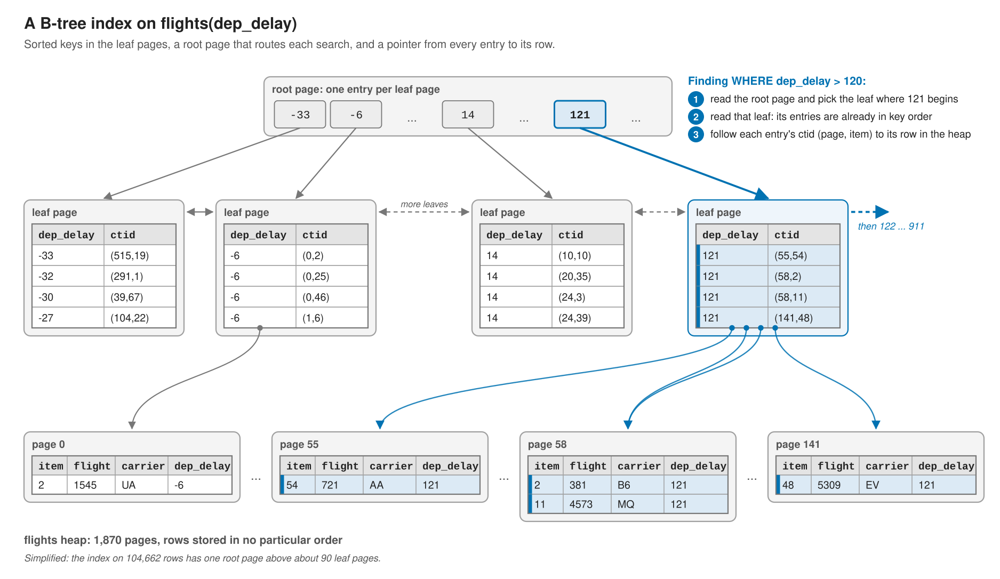
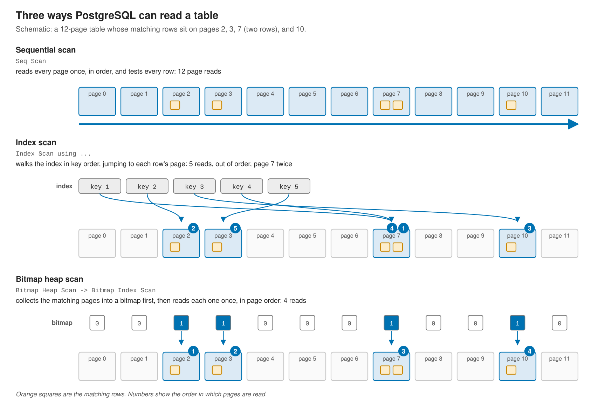
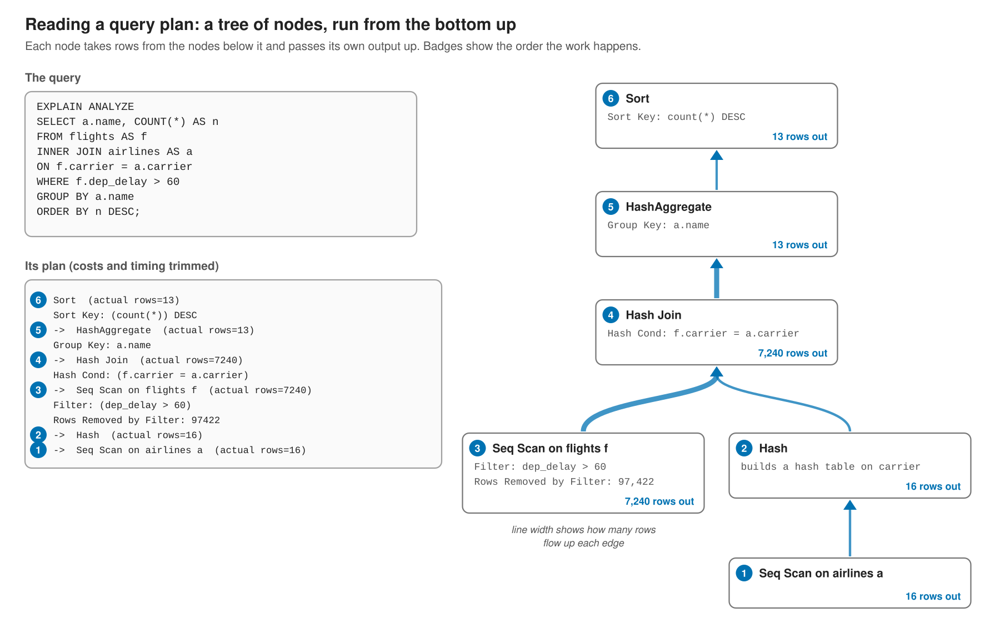
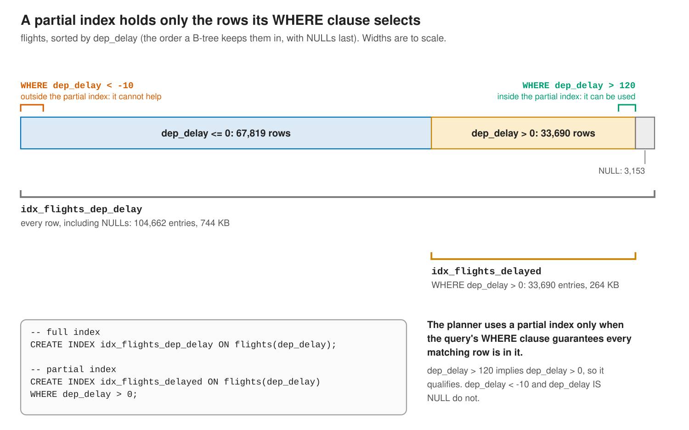
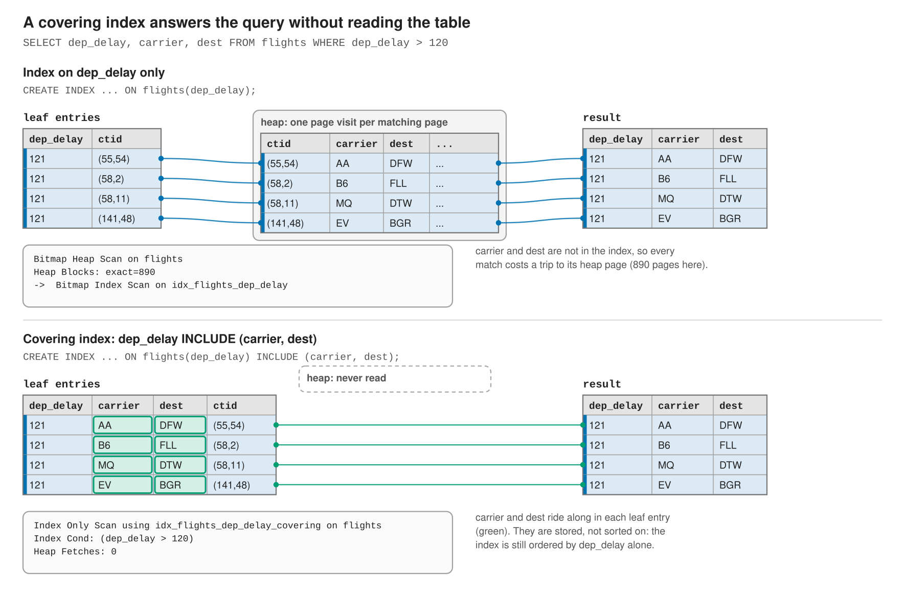

## Learning Objectives

By the end of this chapter, students will be able to:

- **Explain** what a B-tree index is and describe the trade-off between read performance and write and storage overhead.
- **Distinguish** high-cardinality from low-cardinality columns and explain why cardinality affects a filter's selectivity.
- **Read** a query execution plan produced by `EXPLAIN ANALYZE` and interpret the cost, row, and timing annotations.
- **Identify** the three main scan strategies (Sequential Scan, Bitmap Heap Scan, Index Scan) and explain when the planner chooses each.
- **Create** a single-column index and verify with `EXPLAIN ANALYZE` that the planner uses it.
- **Create** a multi-column index and explain how column order affects which queries benefit from it.
- **Write** a partial index that covers only a subset of rows and identify when it is preferable to a full index.
- **Use** the `INCLUDE` clause to create a covering index that satisfies a query entirely from the index without touching the heap.
- **Use** `CREATE INDEX CONCURRENTLY` to build an index without locking the table for writes.
- **Diagnose** cases where an index exists but the planner ignores it, and explain the common causes.

```{r}
#| include: false
source("_common.R")

con <- dbConnect(
  Postgres(),
  host     = "localhost",
  port     = as.integer(Sys.getenv("PGPORT", unset = "5432")),
  dbname   = "nycflights",
  user     = "postgres",
  password = Sys.getenv("PGPASS", unset = "postgres")
)

dbExecute(con, "DROP INDEX IF EXISTS idx_flights_dep_delay")
dbExecute(con, "DROP INDEX IF EXISTS idx_flights_month_carrier")
dbExecute(con, "DROP INDEX IF EXISTS idx_flights_dep_delay_covering")
dbExecute(con, "DROP INDEX IF EXISTS idx_flights_delayed")
```

Every query discussed in the design chapters so far has assumed tables small enough that performance was not a concern. In practice, tables grow. A `flights` table with 100,000 rows behaves quite differently from one with 100 million, and a query that returns in milliseconds today can take seconds or minutes as the data volume increases. Indexes are the primary tool for keeping read performance acceptable as tables scale.

This chapter uses the `nycflights` database. The `flights` table has 104,662 rows and only one index out of the box: a composite primary key. That gives a clean baseline for observing exactly what each new index changes.

## What an Index Is

An index is a separate data structure that the database maintains alongside a table. It stores a copy of one or more columns in a sorted, searchable form, together with a pointer back to the full row in the table. That underlying table storage is called the **heap**, which in database-speak means an unordered pile of rows, stored in whatever order they happened to be inserted, with no sorting to help a search along. An index exists precisely to give a query a fast, sorted path into that unsorted pile. When a query filters on an indexed column, PostgreSQL can traverse the index to find the matching rows directly, rather than reading every row in the heap.

The trade-off is straightforward: indexes make reads faster and writes slower. Every `INSERT`, `UPDATE`, or `DELETE` that touches an indexed column must also update the index. Indexes also consume disk space. A thoughtfully chosen index speeds up the queries that matter most; an excessive number of indexes on a write-heavy table imposes overhead that outweighs any benefit.

PostgreSQL supports several index types. By far the most common is the **B-tree** (balanced tree), which is the default when you write `CREATE INDEX` without specifying a type. A B-tree organizes values in sorted order, which makes it efficient for equality checks (`=`), range queries (`<`, `>`, `BETWEEN`), and sorting. Unless you have a specific reason to choose otherwise, B-tree is the right choice.

The diagram below shows the shape of a B-tree on `flights.dep_delay`, using the table's actual values. Each leaf entry pairs a key with a `ctid`, the row's (page, item) location in the heap:

{fig-alt="A B-tree index on flights.dep_delay, simplified. A root page holds one entry per leaf page, each labeled with the smallest key on that leaf. The leaf pages hold every dep_delay value in sorted order, each paired with a ctid, the (page, item) location of its row in the table's heap, and each leaf links to its neighbors. Four leaves are shown out of about 90. To find dep_delay > 120, PostgreSQL reads the root, descends to the leaf where 121 begins, follows each entry's ctid into the heap (pages 55, 58, and 141 for the first four matches), and walks right along the leaf chain until the keys run out." width="100%"}

## Cardinality and Selectivity

A column's **cardinality** is the number of distinct values it contains. `is_active`, a boolean flag, has a cardinality of at most two, since every row's value is either `TRUE` or `FALSE`; this is a **low-cardinality** column. `tailnum`, a plane's tail number, has a cardinality close to the number of distinct planes that have ever flown, since most values belong to only one or two rows; this is a **high-cardinality** column.

**Selectivity** describes the same idea from a query's point of view: how much a particular filter narrows down the rows it has to consider. `WHERE is_active = TRUE` is not very selective in a table where 95 percent of rows are active because it still keeps almost everything. `WHERE tailnum = 'N14228'` is highly selective, since at most a handful of rows in `flights` share that exact tail number. A high-cardinality column tends to produce highly selective filters, because a given value is unlikely to repeat across many rows. Conversely, a low-cardinality column tends to produce poorly selective filters.

The two terms describe different things: *cardinality* is a property of a column, whereas *selectivity* is a property of a filter. But the concepts are so closely intertwined that it's easy to mix them up, and the rest of this chapter uses them almost interchangeably. But the main point remains: index the high-cardinality columns because those are the ones that tend to produce selective filters that an index can make much faster.

## Reading Query Plans

Before creating any index, it is worth understanding how to read the query plan that PostgreSQL produces. The `EXPLAIN` command shows the plan without executing the query; `EXPLAIN ANALYZE` executes it and adds actual timing and row counts alongside the estimates.

```{r}
#| label: explain-no-index
writeLines(dbGetQuery(con,
  "EXPLAIN ANALYZE SELECT * FROM flights WHERE dep_delay > 120"
)[[1]])
```

The plan output is a tree of **nodes**, each representing one operation. Reading the cost annotation on a node:

```
Seq Scan on flights  (cost=0.00..3178.28 rows=2778 width=81)
                     (actual time=0.019..11.192 rows=2791 loops=1)
```

- **cost=0.00..3178.28**: estimated work to return the first row (startup) and all rows (total). These are relative units the planner uses to compare strategies, not milliseconds.
- **rows=2778**: estimated row count. The actual count follows in the ANALYZE output.
- **width=81**: average bytes per output row.
- **actual time=0.019..11.192**: measured wall-clock milliseconds to first row and last row.
- **loops=1**: how many times this node executed. Nodes inside a nested loop execute once per outer row.

The `Rows Removed by Filter: 101871` line shows how many rows the scan read and discarded. For this query, PostgreSQL examined all 104,662 rows to find 2,791 that matched, taking about 11 milliseconds.

### The Three Scan Strategies

PostgreSQL chooses among three scan strategies depending on how selective the filter is relative to the table size:

| Strategy | When chosen | Characteristic |
|---|---|---|
| **Sequential Scan** | Large fraction of the table | Reads all pages linearly |
| **Bitmap Heap Scan** | Moderate fraction | Builds a page bitmap, then fetches only those pages |
| **Index Scan** | Very few rows | Traverses index leaf by leaf, fetching each heap row immediately |

A sequential scan is not always wrong. For filters that match a large percentage of a table, reading the table linearly is faster than the random I/O of an index lookup. The planner chooses based on estimated cost.

The difference between the three is the order in which they read the table's pages:

{fig-alt="A schematic 12-page table where the matching rows sit on pages 2, 3, 7 (two rows), and 10. A sequential scan reads all 12 pages in order and tests every row. An index scan walks the index in key order and jumps to each row's page as it goes: pages 7, 2, 10, 7, 3, so page 7 is read twice and the reads are out of order. A bitmap heap scan first collects the matching pages from the index into a bitmap, then reads pages 2, 3, 7, and 10 once each, in physical order, rechecking the condition on each page." width="100%"}

Plans for queries with joins and aggregates contain more nodes, arranged as a tree. Each node takes rows from the nodes beneath it, so a plan is read from the bottom up:

{fig-alt="EXPLAIN ANALYZE for a query that joins flights to airlines, keeps flights delayed more than 60 minutes, counts them per airline, and sorts the counts. The plan is a tree read from the bottom up. A sequential scan of airlines (16 rows) feeds a Hash node that builds a hash table. A sequential scan of flights keeps 7,240 of 104,662 rows. The Hash Join matches those 7,240 flights to their airlines, HashAggregate groups them into 13 airlines, and Sort orders the 13 counts." width="100%"}

## Creating a Basic Index

The `dep_delay > 120` query above identified severely delayed flights: 2,791 rows, or about 2.7 percent of the table. That selectivity is a good candidate for an index.

```{r}
#| label: create-basic-index
#| include: false
dbExecute(con, "CREATE INDEX idx_flights_dep_delay ON flights(dep_delay)")
```

With the index in place, the plan changes:

```{r}
#| label: explain-with-index
writeLines(dbGetQuery(con,
  "EXPLAIN ANALYZE SELECT * FROM flights WHERE dep_delay > 120"
)[[1]])
```

The planner switched to a **Bitmap Heap Scan**. It first ran a `Bitmap Index Scan` to traverse the new index and build an in-memory bitmap of pages containing matching rows, then fetched only those pages from the heap. Execution time dropped from about 11 milliseconds to about 2, a roughly five-fold improvement.

For a more selective filter (flights delayed over five hours), the same index is even more effective:

```{r}
#| label: explain-highly-selective
writeLines(dbGetQuery(con,
  "EXPLAIN ANALYZE SELECT * FROM flights WHERE dep_delay > 300"
)[[1]])
```

Only 228 rows match. With so few results, PostgreSQL uses a pure **Index Scan** rather than the bitmap approach, fetching each matching heap row directly from the index. Execution time falls under a millisecond.

The shift from Bitmap Heap Scan to Index Scan reflects the planner's logic: when very few pages need to be fetched, the overhead of building a bitmap is not worth it. Random I/O directly from the index is faster.

```{r}
#| label: drop-basic-index
#| include: false
dbExecute(con, "DROP INDEX idx_flights_dep_delay")
```

## Multi-Column Indexes

When queries frequently filter on two or more columns together, a multi-column index can be more efficient than separate single-column indexes.

Without any additional index, filtering on both month and carrier requires a full sequential scan:

```{r}
#| label: explain-multi-before
writeLines(dbGetQuery(con,
  "EXPLAIN ANALYZE SELECT * FROM flights WHERE month = 7 AND carrier = 'UA'"
)[[1]])
```

652 rows match. Creating a composite index on both columns eliminates the full scan:

```{r}
#| label: create-multi-index
#| include: false
dbExecute(con, "CREATE INDEX idx_flights_month_carrier ON flights(month, carrier)")
```

```{r}
#| label: explain-multi-after
writeLines(dbGetQuery(con,
  "EXPLAIN ANALYZE SELECT * FROM flights WHERE month = 7 AND carrier = 'UA'"
)[[1]])
```

Execution time drops from about 11 milliseconds to well under 1 millisecond.

### Column Order and the Leading-Column Rule

The order of columns in a multi-column index determines which queries can use it. An index on `(month, carrier)` is organized first by month, then by carrier within each month. A query that filters on `month` alone can use this index, because month is the leading column. A query that filters on `carrier` alone cannot use the index efficiently: carrier values are interleaved across all months, so the index provides no useful ordering.

```{r}
#| label: explain-non-leading
writeLines(dbGetQuery(con,
  "EXPLAIN ANALYZE SELECT * FROM flights WHERE carrier = 'UA'"
)[[1]])
```

PostgreSQL does use the index here, but the cost is much higher than the two-column query: it must scan nearly the entire index to collect all United Airlines entries scattered across all 12 months. A dedicated single-column index on `carrier` would outperform this. The general rule is to place the most selective column, or the one that appears in the most queries, first.

```{r}
#| label: drop-multi-index
#| include: false
dbExecute(con, "DROP INDEX idx_flights_month_carrier")
```

## Partial Indexes

A **partial index** covers only the rows that satisfy a `WHERE` clause specified at creation time. It is smaller than a full index, builds faster, and uses less memory.

The `flights` table has 3,153 rows where `dep_delay IS NULL`: cancelled or diverted flights that never received a departure delay measurement. Queries about departure delays almost never want these rows. An index on `dep_delay` that includes them wastes space on values that will never be matched in a filter like `dep_delay > 0`.

```sql
CREATE INDEX idx_flights_delayed ON flights(dep_delay)
WHERE dep_delay > 0;
```

This index covers only the 33,690 rows with a positive delay, about a third of the table. Queries that filter on positive delays use the partial index just as they would a full index, but the index itself is one-third the size.

{fig-alt="The 104,662 flights sorted by dep_delay, the order a B-tree keeps them in, with NULLs last: 67,819 rows with dep_delay of 0 or less, 33,690 with a positive delay, and 3,153 with no dep_delay. A full index on dep_delay holds an entry for every row and takes 744 KB. A partial index created WITH WHERE dep_delay > 0 holds only the 33,690 delayed rows and takes 264 KB, about a third of the size. A query for dep_delay > 120 falls inside the partial index's range, so the planner can use it. A query for dep_delay < -10 falls outside it and cannot." width="100%"}

```{r}
#| label: create-partial-index
#| include: false
dbExecute(con, "CREATE INDEX idx_flights_delayed ON flights(dep_delay) WHERE dep_delay > 0")
```

```{r}
#| label: explain-partial
writeLines(dbGetQuery(con,
  "EXPLAIN ANALYZE SELECT * FROM flights WHERE dep_delay > 120"
)[[1]])
```

The plan shows the partial index in use. The planner recognizes that `dep_delay > 120` is a subset of the partial index's `dep_delay > 0` condition and uses it accordingly. A query that does not satisfy the partial index predicate (such as `WHERE dep_delay IS NULL`) will not use it and will fall back to a sequential scan.

```{r}
#| label: drop-partial-index
#| include: false
dbExecute(con, "DROP INDEX idx_flights_delayed")
```

## Covering Indexes

An **index-only scan** occurs when every column needed by a query is present in the index itself, meaning PostgreSQL never needs to touch the heap at all. The `INCLUDE` clause adds extra columns to the index specifically for this purpose, without making them part of the sort order.

Consider a query that selects only `dep_delay`, `carrier`, and `dest`:

```{r}
#| label: explain-covering-before
writeLines(dbGetQuery(con,
  "EXPLAIN ANALYZE SELECT dep_delay, carrier, dest FROM flights WHERE dep_delay > 120"
)[[1]])
```

Without an index, this is a sequential scan. A standard index on `dep_delay` would enable a bitmap heap scan, but the heap fetch would still be necessary to retrieve `carrier` and `dest`. Adding those columns to the index via `INCLUDE` eliminates the heap fetch entirely:

```{r}
#| label: create-covering-index
#| include: false
dbExecute(con,
  "CREATE INDEX idx_flights_dep_delay_covering ON flights(dep_delay) INCLUDE (carrier, dest)"
)
```

```{r}
#| label: explain-covering-after
writeLines(dbGetQuery(con,
  "EXPLAIN ANALYZE SELECT dep_delay, carrier, dest FROM flights WHERE dep_delay > 120"
)[[1]])
```

The plan now shows `Index Only Scan` with `Heap Fetches: 0`. Every value the query needs is available directly from the index pages, without reading the heap. Execution time drops from about 11 milliseconds to under half a millisecond.

{fig-alt="Two ways to answer SELECT dep_delay, carrier, dest FROM flights WHERE dep_delay > 120. With an index on dep_delay alone, the index finds the matching entries, but carrier and dest are not in it, so PostgreSQL follows each entry's ctid into the heap to read them: a bitmap heap scan that touched 890 heap pages. With an index on dep_delay INCLUDE (carrier, dest), the leaf entries carry carrier and dest as extra payload, so the query is answered from the index alone: an index-only scan with Heap Fetches: 0." width="100%"}

Covering indexes are most valuable for queries that run very frequently on large tables and return only a few columns. The cost is a larger index on disk.

```{r}
#| label: drop-covering-index
#| include: false
dbExecute(con, "DROP INDEX idx_flights_dep_delay_covering")
```

## Expression Indexes

PostgreSQL can index the result of a function or expression rather than a raw column value. This is necessary when queries apply a function to a column in the `WHERE` clause.

A common example is case-insensitive email lookup. A schema that stores email addresses as mixed case cannot use a plain index on `email` to satisfy `WHERE LOWER(email) = 'user@example.com'`, because the index stores the original case. An expression index on `LOWER(email)` solves the problem:

```sql
CREATE INDEX idx_students_email_lower ON students(LOWER(email));
```

A query written as `WHERE LOWER(email) = 'user@example.com'` will now use this index. A query written as `WHERE email = 'User@Example.com'` will not, because the expressions do not match.

The same principle applies to any function used in a filter: `EXTRACT(year FROM created_at)`, `date_trunc('month', created_at)`, `jsonb_extract_path_text(payload, 'event_type')`. If a function appears in your `WHERE` clause and the query is slow, an expression index on that function is likely the fix.

## CREATE INDEX CONCURRENTLY

By default, `CREATE INDEX` acquires a lock that blocks all writes to the table for the duration of the build. On a small table this takes milliseconds. On a large production table it can block inserts and updates for minutes.

`CREATE INDEX CONCURRENTLY` builds the index in the background without blocking writes:

```sql
CREATE INDEX CONCURRENTLY idx_flights_dep_delay ON flights(dep_delay);
```

The trade-off is that it takes longer to build, requires two passes over the table, and cannot be run inside a transaction block. If the build fails partway through, it leaves an invalid index behind that must be dropped manually before retrying.

For any table that receives ongoing writes in a production environment, `CONCURRENTLY` is the safe default.

## When Indexes Are Not Used

An index exists but the planner ignores it in several common situations.

**Low selectivity.** If a filter matches a large fraction of the table, the planner correctly prefers a sequential scan. An index on a boolean column in a table where 95 percent of rows have `is_active = true` will rarely be used for `WHERE is_active = true`, because fetching 95 percent of the table through random I/O is slower than a linear scan.

**Function wrapping.** Applying a function to an indexed column in the `WHERE` clause breaks the match between the query and the index. `WHERE EXTRACT(month FROM time_hour) = 7` cannot use an index on `time_hour`, because the index stores raw timestamps, not extracted months. Either write the filter as a range (`WHERE time_hour >= '2013-07-01' AND time_hour < '2013-08-01'`) or create an expression index.

**Type mismatch.** Comparing a column to a value of a different type forces an implicit cast that may prevent index use. `WHERE flight = '301'` (comparing an integer column to a text literal) can suppress the index, depending on how PostgreSQL resolves the cast. Always match the literal type to the column type.

**Stale statistics.** The planner estimates how many rows a filter will return using statistics collected by `ANALYZE`. If those statistics are far out of date, the planner may underestimate selectivity and choose a sequential scan when an index scan would be faster. Running `ANALYZE table_name` refreshes the statistics.

## Identifying Index Candidates

Not every column deserves an index. A useful mental checklist:

- **Columns that appear in `WHERE` clauses frequently.** The more often a column is filtered, the more benefit an index provides.
- **Join keys.** A `JOIN` has to match rows between two tables on some column, and PostgreSQL has more than one strategy for finding those matches. A **nested-loop join** strategy checks every row of one table against every row of the other, which is slow without an index to speed up the matching. A **hash join** strategy instead builds a quick-lookup structure, known as a **hash table**, from the smaller table's join column, then scans the larger table once, checking each row against that structure instead of against every row individually. This is faster than a nested loop, but it still means reading every row of both tables at least once. Whichever strategy the planner picks, adding an index on the join column gives it a faster way to find matches, which is why join columns are strong index candidates.
- **Foreign key columns.** PostgreSQL does not automatically index foreign keys (unlike some other databases). A missing foreign key index can cause slow cascading deletes and slow joins.
- **High-cardinality columns.** A column with many distinct values (an email address or a birthdate column) tends to produce the highly selective filters an index speeds up most, unlike a low-cardinality column with only a handful of distinct values, like a status flag.
- **Columns used in `ORDER BY`.** If a query both filters and sorts on the same column, the index may satisfy both operations, resulting in fewer steps for the query planner.

Columns that are written to constantly, rarely queried, or low-cardinality are poor candidates. Monitor query performance over time and add indexes in response to observed slow queries rather than preemptively indexing every column.

## Exercises {.unnumbered}

### Reflection {.unnumbered}

**1.** Explain, in your own words, the difference between cardinality and selectivity. Is `carrier` (16 distinct values across 104,662 rows) a high-cardinality or low-cardinality column? Would `WHERE carrier = 'UA'` be a selective filter?

---

**2.** A classmate adds an index to every column in a table "just in case a query needs it someday." Explain why this is not automatically a good idea, referencing both the write-side cost of an index and the planner's willingness to actually use one.

---

**3.** Explain why `WHERE EXTRACT(month FROM time_hour) = 7` cannot use a plain index on `time_hour`, and describe two different ways to fix the query so that it can use an index.

---

### Practical {.unnumbered}

**4.** Using `EXPLAIN ANALYZE`, compare the query plan for `SELECT * FROM flights WHERE dest = 'ORD'` before and after creating an index on `dest`. Report the scan strategy PostgreSQL chose in each case and the change in execution time.

---

**5.** Create a multi-column index on `(origin, dest)`. Write one query that can use it efficiently and one query, filtering on `dest` alone, that cannot use it as efficiently. Explain the difference by referencing the leading-column rule.

---

**6.** The `flights` table has an `air_time` column that is `NULL` for cancelled flights. Create a partial index on `air_time` that excludes `NULL` values, and write a query that benefits from it.

---

**7.** Add `carrier` as an `INCLUDE` column on an index over `dep_delay`, then write a query that can be satisfied entirely by an index-only scan. Confirm with `EXPLAIN ANALYZE` that `Heap Fetches` is `0`.

---

**8.** Using the checklist from this chapter, evaluate `flights.tailnum` as an index candidate: is it high- or low-cardinality, does it appear in joins, and would you expect the planner to use an index on it? Create the index and check your prediction with `EXPLAIN ANALYZE`.
